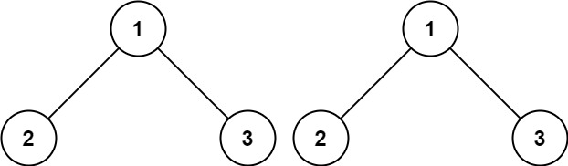

# 100. 相同的树 <Badge type="tip" text="Easy" />

给你两棵二叉树的根节点 p 和 q ，编写一个函数来检验这两棵树是否相同。

如果两个树在结构上相同，并且节点具有相同的值，则认为它们是相同的。


>示例 1:  
输入：p = [1,2,3], q = [1,2,3]  
输出：true



>示例 2:  
输入：p = [1,2], q = [1,null,2]  
输出：false


>示例 3:  
输入：p = [1,2,1], q = [1,1,2]  
输出：false


## 解题思路

**输入**：两个二叉树的根节点 `p` 和 `q`

**输出**：判断两棵树是否相同

本题属于**自底向上 DFS**问题。

我们可以将问题拆解成：**递归地比较同一位置的子树**，判断它们是否相等。

具体步骤：

1. 如果其中一个节点为空，只有两者都为空才返回 `True`（否则为 `False`）。
2. 如果当前两个节点的值不相同，直接返回 `False`。
3. 递归比较左右子树对应位置是否相同。
4. 如果所有对应位置的值和结构都相同，则两棵树相同。

## 代码实现

::: code-group

```python
class Solution:
    def isSameTree(self, p: Optional[TreeNode], q: Optional[TreeNode]) -> bool:
        # 如果有任意一个节点为空，只有两者都为空时才相等
        if p is None or q is None:
            return p is q
        
        # 如果当前节点值不相等，直接返回False
        if p.val != q.val:
            return False
        
        # 递归比较左子树和右子树
        return self.isSameTree(p.left, q.left) and self.isSameTree(p.right, q.right)
```

```javascript
/**
 * @param {TreeNode} p
 * @param {TreeNode} q
 * @return {boolean}
 */
var isSameTree = function(p, q) {
    if (p == null || q == null) return p == q;

    if (p.val !== q.val) return false;

    return isSameTree(p.left, q.left) && isSameTree(p.right, q.right);
};
```

:::

## 复杂度分析

时间复杂度：O(n)

空间复杂度：O(h)

## 链接

[100 国际版](https://leetcode.com/problems/same-tree/description/)

[100 中文版](https://leetcode.cn/problems/same-tree/description/)
