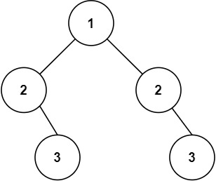

# 101. 对称二叉树 <Badge type="tip" text="Easy" />

给你一个二叉树的根节点 `root` ， 检查它是否轴对称。

>示例 1:  
输入：root = [1,2,2,3,4,4,3]  
输出：true


>示例 2:  
输入：root = [1,2,2,null,3,null,3]  
输出：false



## 解题思路

**输入**：一个二叉树的根节点 `root`

**输出**：判断这棵树是否对称

本题属于**自底向上 DFS**问题。

因为只有一棵树所以根节点一定相同。

我们可以将问题拆解成：**递归地比较左右子树的对称位置**，判断它们是否相等。

写法与 100 题一致，区别在于要将 **对称** 比较。

具体步骤：

1. 如果其中一个节点为空，只有两者都为空才返回 `True`（否则为 `False`）。
2. 如果当前两个节点的值不相同，直接返回 `False`。
3. 递归比较左右子树对称位置是否相同。
4. 如果所有对称位置的值和结构都相同，则两棵树相同。

## 代码实现

::: code-group

```python
class Solution:
    def isSymmetric(self, root: Optional[TreeNode]) -> bool:
        # 这题可以看成是判断左子树是否和右子树相同来解
        return self.isSameTree(root.left, root.right)
    
    # 与 100 题相似，判断是否是相同的树
    def isSameTree(self, p, q):
        if not p or not q:
            return p is q

        if p.val != q.val:
            return False

        return self.isSameTree(p.left, q.right) and self.isSameTree(p.right, q.left)
```

```javascript
/**
 * @param {TreeNode} root
 * @return {boolean}
 */
var isSymmetric = function(root) {
    function isSameTree(p, q) {
        if (p == null || q == null) return p == q;

        if (p.val !== q.val) return false;

        return isSameTree(p.left, q.right) && isSameTree(p.right, q.left);
    }

    return isSameTree(root.left, root.right);
};
```

:::

## 复杂度分析

时间复杂度：O(n)

空间复杂度：O(h)

## 链接

[101 国际版](https://leetcode.com/problems/symmetric-tree/description/)

[101 中文版](https://leetcode.cn/problems/symmetric-tree/description/)
