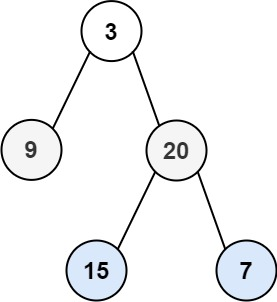

# 103. 二叉树的锯齿形层序遍历 <Badge type="warning" text="Medium" />

给你二叉树的根节点 `root` ，返回其节点值的 锯齿形层序遍历 。（即先从左往右，再从右往左进行下一层遍历，以此类推，层与层之间交替进行）。



>示例 1:  
输入：root = [3,9,20,null,null,15,7]  
输出：[[3],[20,9],[15,7]]

>示例 2:  
输入：root = [1]  
输出：[[1]]

>示例 3:  
输入：root = []  
输出：[]

## 解题思路

输入： 一个二叉树的根节点 `root`。

输出： 返回节点值的 锯齿形层序遍历。

本题属于**遍历二叉树**问题，典型的 广度优先搜索（BFS），也称为 层序遍历。

* 我们使用一个队列（Queue），按“从左到右、从上到下”的顺序逐层遍历节点：
* 每次从队列中取出当前层的所有节点
* 依次访问这些节点，记录它们的值
* 将它们的左子节点和右子节点加入队列
* **判断当前是奇数层还是偶数层**，调整方向后再添加至答案
* 重复此过程，直到队列为空

## 代码实现

::: code-group

```python
class Solution:
    def zigzagLevelOrder(self, root: Optional[TreeNode]) -> List[List[int]]:
        # 如果根节点为空，返回空列表
        if not root:
            return []

        # 初始化结果列表
        ans = []
        # 初始化队列，存储当前层的节点
        queue = [root]
        # 标志变量，控制是否需要反转当前层的节点值
        even = False

        # 当队列不为空时，继续处理
        while queue:
            # 存储下一层的节点
            nxt = []
            # 存储当前层的节点值
            vals = []

            # 遍历当前层的节点
            for node in queue:
                # 将当前节点值加入 vals 列表
                vals.append(node.val)

                # 如果左子节点存在，加入下一层队列
                if node.left:
                    nxt.append(node.left)
                
                # 如果右子节点存在，加入下一层队列
                if node.right:
                    nxt.append(node.right)
            
            # 更新队列为下一层的节点
            queue = nxt
            # 根据 even 标志决定是否反转当前层的节点值
            # 偶数层反转，奇数层保持原序
            ans.append(vals[::-1] if even else vals)
            # 翻转标志位，为下一层做准备
            even = not even
        
        # 返回最终的锯齿形层序遍历结果
        return ans
```

```javascript
/**
 * @param {TreeNode} root
 * @return {number[][]}
 */
var zigzagLevelOrder = function(root) {
    if (!root) return [];

    const ans = [];
    let queue = [root];
    let even = false;
    
    while (queue.length) {
        const nxt = [];
        const vals = [];

        for (let node of queue) {
            vals.push(node.val);

            if (node.left) nxt.push(node.left);

            if (node.right) nxt.push(node.right);
        }

        queue = nxt;
        if (even) {
            vals.reverse();
        }

        ans.push(vals);
        even = !even;
    }
    return ans;
};
```

:::

## 复杂度分析

时间复杂度：O(n)

空间复杂度：O(w)， w 为树的最大宽度

## 链接

[103 国际版](https://leetcode.com/problems/binary-tree-zigzag-level-order-traversal/description/)

[103 中文版](https://leetcode.cn/problems/binary-tree-zigzag-level-order-traversal/description/)
