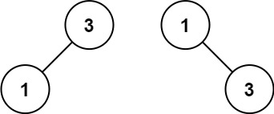

# 108. 将有序数组转换为二叉搜索树 <Badge type="tip" text="Easy" />

给你一个整数数组 `nums` ，其中元素已经按 升序 排列，请你将其转换为一棵 平衡 二叉搜索树。


>示例 1:  
输入：nums = [-10,-3,0,5,9]   
输出：[0,-3,9,-10,null,5]   
解释：[0,-10,5,null,-3,null,9] 也将被视为正确答案：


>示例 2:  
输入：nums = [1,3]   
输出：[3,1]   
解释：[1,null,3] 和 [3,1] 都是高度平衡二叉搜索树。



## 解题思路

**输入：** 一个排好序的整数数组 `nums`

**输出：** 转成一颗平衡二叉搜索树

本题属于**二叉搜索树**问题。

**平衡二叉搜索树的性质：**
- 左子树所有节点值 < 根节点值
- 右子树所有节点值 > 根节点值
- 左右子树高度差不超过 1

有序数组直接取中点作为根节点，能保证左右元素数量差 `≤ 1`，因此天然平衡。

递归拆分区间 `[l, r]`，中点做根，左右区间继续递归构造左右子树。

## 代码实现

::: code-group

```python
class Solution:
    def sortedArrayToBST(self, nums: List[int]) -> Optional[TreeNode]:
        # 递归函数：根据数组区间 [l, r] 构建平衡二叉搜索树
        def build(l, r):
            # 当左指针大于右指针时，说明区间无效，返回空节点
            if l > r:
                return None
            
            # 取中间位置作为根节点（保证左右子树节点数尽量接近）
            mid = (l + r) // 2
            # 创建当前根节点
            root = TreeNode(nums[mid])
            # 递归构建左子树：使用左半部分数组
            root.left = build(l, mid - 1)
            # 递归构建右子树：使用右半部分数组
            root.right = build(mid + 1, r)
            # 返回当前构建好的子树根节点
            return root

        # 从整个数组区间开始构建
        return build(0, len(nums) - 1)
```

```javascript
var sortedArrayToBST = function(nums) {
    function build(l, r) {
        if (l > r) return null;
        const mid = Math.floor((l + r) / 2);
        const root = new TreeNode(nums[mid]);
        root.left = build(l, mid - 1);
        root.right = build(mid + 1, r);

        return root;
    }

    return build(0, nums.length -1);
};
```

:::

## 复杂度分析

时间复杂度：O(n)

空间复杂度：O(nlogn)

## 链接

[108 国际版](https://leetcode.com/problems/convert-sorted-array-to-binary-search-tree/description/)

[108 中文版](https://leetcode.cn/problems/convert-sorted-array-to-binary-search-tree/description/)
