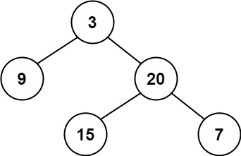

# 110. 平衡二叉树 <Badge type="tip" text="Easy" />

给定一个二叉树，判断它是否是 平衡二叉树  

平衡二叉树 是指该树所有节点的左右子树的高度相差不超过 1

>示例 1:  
输入：root = [3,9,20,null,null,15,7]  
输出：true



>示例 2:  
输入：root = [1,2,2,3,3,null,null,4,4]  
输出：false


>示例 3:  
输入：root = []  
输出：true

## 解题思路

**输入**：一个二叉树的根节点 `root`

**输出**：判断这棵树是否是平衡二叉树

本题属于**自底向上 DFS**问题。

我们可以将问题拆解成以下几步：

* 递归计算每棵子树的高度：`max(left_height, right_height) + 1`。
* 如果某棵子树的左右子树高度差大于 1，则说明这棵树不平衡，返回 `-1` 表示不平衡。
* 在递归入口处，先判断返回值是否为 `-1`，如果是，则立即退出并返回 `-1` 传递给上层调用。
* 只有当所有子树都是平衡的，才最终返回它们的高度，保证整棵树平衡。

这样我们就能高效地判断整棵树是否平衡，并且一旦发现不平衡就可以提前剪枝，避免重复计算。

## 代码实现

::: code-group

```python
class Solution:
    def isBalanced(self, root: Optional[TreeNode]) -> bool:
        """
        判断一棵二叉树是否平衡二叉树
        平衡二叉树：任意节点的左右子树高度差不超过 1
        """
        def get_height(node):
            """
            计算树的高度，同时判断是否平衡
            返回值：
                - 如果子树平衡，则返回其高度
                - 如果子树不平衡，则返回 -1
            """
            if node is None:
                return 0  # 空树高度为0
            
            # 递归获取左子树高度
            left_height = get_height(node.left)
            # 如果左子树已经不平衡，则整棵树也不平衡
            if left_height == -1:
                return -1
            
            # 递归获取右子树高度
            right_height = get_height(node.right)
            # 如果右子树不平衡，或者左右子树高度差超过1，则当前子树也不平衡
            if right_height == -1 or abs(left_height - right_height) > 1:
                return -1
            
            # 返回当前子树的高度
            return max(left_height, right_height) + 1
        
        # 判断整棵树是否平衡
        return get_height(root) != -1
```

```javascript
/**
 * @param {TreeNode} root
 * @return {boolean}
 */
var isBalanced = function(root) {
    function getHeight(node) {
        if (!node) return 0;

        const leftHeight = getHeight(node.left);
        if (leftHeight == -1) return -1;

        const rightHeight = getHeight(node.right);
        if (rightHeight == -1 || Math.abs(leftHeight - rightHeight) > 1) {
            return -1;
        }

        return Math.max(leftHeight, rightHeight) + 1;
    }

    return getHeight(root) !== -1;
};
```

:::

## 复杂度分析

时间复杂度：O(n)

空间复杂度：O(h)

## 链接

[110 国际版](https://leetcode.com/problems/balanced-binary-tree/description/)

[110 中文版](https://leetcode.cn/problems/balanced-binary-tree/description/)
