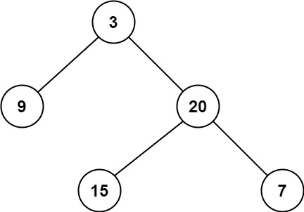

# 111. 二叉树的最小深度 <Badge type="tip" text="Easy" />

给定一个二叉树，找出其最小深度。

最小深度是从根节点到最近叶子节点的最短路径上的节点数量。

说明：叶子节点是指没有子节点的节点。



>示例 1:  
输入：root = [3,9,20,null,null,15,7]  
输出：2

>示例 2:  
输入：root = [2,null,3,null,4,null,5,null,6]  
输出：5

## 解题思路

输入： 一个二叉树的根节点 root。

输出： 返回最小深度

本题属于**广度优先搜索（BFS）**问题。

**初始化：**  
* 若 `root` 为空，返回 0（空树的深度为 0）
* 初始化队列 `queue = [(root, 1)]`，其中保存的是节点和其对应的当前深度

**BFS 遍历：**  
* 每次从队列中取出一个节点 `node` 和它的 `depth`
* 如果 `node` 是 叶子节点（没有左右孩子），立即返回当前深度 `depth`
* 否则，将它的左右子节点（若存在）加入队列，深度加一

## 代码实现

::: code-group

```python
class Solution:
    def minDepth(self, root: Optional[TreeNode]) -> int:
        # 如果根节点为空，说明树是空的，最小深度为 0
        if not root:
            return 0

        # 使用 BFS（广度优先搜索）队列，初始化放入根节点和当前深度 1
        queue = [(root, 1)]

        # 开始逐层遍历二叉树
        while queue:
            node, depth = queue.pop(0)  # 取出当前节点及其深度

            # 如果当前节点是叶子节点（没有左右子节点），说明找到了最浅的一条路径
            if not node.left and not node.right:
                return depth  # 返回当前深度作为最小深度
            
            # 如果左子节点存在，加入队列，深度 +1
            if node.left:
                queue.append((node.left, depth + 1))
            
            # 如果右子节点存在，加入队列，深度 +1
            if node.right:
                queue.append((node.right, depth + 1))
```

```javascript
const minDepth = function(root) {
    // 如果根节点为空，说明树是空的，最小深度为 0
    if (!root) return 0;

    // 使用 BFS（广度优先搜索）队列，初始化放入根节点和当前深度 1
    const queue = [[root, 1]];

    // 开始逐层遍历二叉树
    while (queue.length) {
        // 取出当前节点及其深度
        const [node, depth] = queue.shift();

        // 如果当前节点是叶子节点（没有左右子节点），说明找到了最浅的一条路径
        if (!node.left && !node.right)
            return depth;
        
        // 如果左子节点存在，加入队列，深度 +1
        if (node.left) 
            queue.push([node.left, depth + 1])

        // 如果右子节点存在，加入队列，深度 +1
        if (node.right) 
            queue.push([node.right, depth + 1])
    }
};
```

:::

## 复杂度分析

时间复杂度：O(n)

空间复杂度：O(h)

## 链接

[111 国际版](https://leetcode.com/problems/minimum-depth-of-binary-tree/description/)

[111 中文版](https://leetcode.cn/problems/minimum-depth-of-binary-tree/description/)
