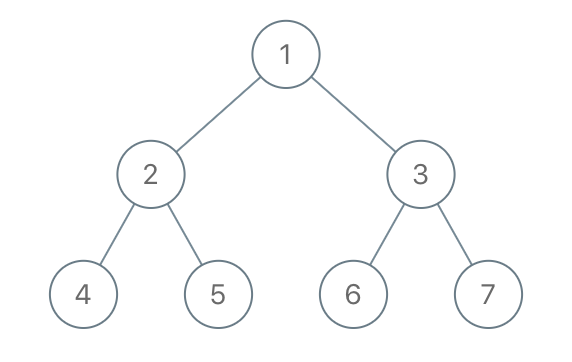

# 1110. 删点成林 <Badge type="warning" text="Medium" />

给出二叉树的根节点 `root`，树上每个节点都有一个不同的值。

如果节点值在 `to_delete` 中出现，我们就把该节点从树上删去，最后得到一个森林（一些不相交的树构成的集合）。

返回森林中的每棵树。你可以按任意顺序组织答案。

>示例 1:  
输入：root = [1,2,3,4,5,6,7], to_delete = [3,5]  
输出：[[1,2,null,4],[6],[7]]



>示例 2:  
输入：root = [1,2,4,null,3], to_delete = [3]   
输出：[[1,2,4]]

## 解题思路

输入： 一个二叉树的根节点 `root`, 一个删除列表 `to_delete`。

输出： 返回一个不包含删除节点值的树的集合。

本题属于**自底向上 DFS + 剪枝**问题。

这道题的核心是通过 **后序遍历（自底向上 DFS）** 递归处理二叉树，删除指定节点，并收集剩余子树的根节点形成森林（集合）。

### 问题本质
* 删除节点：将 `to_delete` 中的节点从树中移除，断开父节点与它们的连接。
* 形成森林：删除一个节点后，其非空的左右子树成为新的子树根节点，加入结果列表。

**关键点：**

* 需要跟踪哪些节点是森林的根节点（即没有父节点或父节点被删除的节点）。
* 删除操作会改变树结构，因此需要确保子树先被处理（后序遍历）。
* 根节点需要特殊处理，因为它没有父节点。


### 核心逻辑

**后序遍历：**

* 先递归处理左右子树，更新左右子树的结构（删除指定节点后的结果）。
* 再处理当前节点，决定是否删除，以及是否将子树加入森林。

**删除规则：**

* 如果当前节点值在 `to_delete` 中：
* 将其非空的左右子树加入结果列表（作为新子树的根）。
* 返回 `None`，表示当前节点被删除。

**如果当前节点不删除：**

* 更新其左右子树指针（基于递归结果）。
* 如果它是根节点或其父节点被删除，则加入结果列表。

**根节点处理：**

*根节点没有父节点，因此需要单独检查是否保留（未被删除则加入结果）。

## 代码实现

::: code-group

```python
class Solution:
    def delNodes(self, root: Optional[TreeNode], to_delete: List[int]) -> List[TreeNode]:
        result = []
        delete_set = set(to_delete)  # 转为集合，提升查找效率

        def dfs(node):
            if not node:
                return None  # 空节点返回 None，递归终止

            # 递归处理左右子树
            node.left = dfs(node.left)
            node.right = dfs(node.right)

            # 当前节点需要删除
            if node.val in delete_set:
                # 如果有子节点，将其作为新的树根加入结果列表
                if node.left:
                    result.append(node.left)
                if node.right:
                    result.append(node.right)
                return None  # 返回 None 表示该节点被删除

            # 当前节点不被删除，正常返回
            return node

        # 特殊处理：如果根节点不在删除列表中，作为结果树的根加入
        if dfs(root):
            result.append(root)

        return result
```

```javascript
/**
 * @param {TreeNode} root
 * @param {number[]} to_delete
 * @return {TreeNode[]}
 */
var delNodes = function(root, to_delete) {
    const ans = [];
    const s = new Set(to_delete);

    function dfs(node) {
        if (!node) return null;

        node.left = dfs(node.left);
        node.right = dfs(node.right);

        if (s.has(node.val)) {
            if (node.left) ans.push(node.left);
            if (node.right) ans.push(node.right);
            return null;
        }

        return node;
    }

    if (dfs(root))
        ans.push(root);

    return ans;
};
```

:::

## 复杂度分析

时间复杂度：O(n)

空间复杂度：O(n)

## 链接

[1110 国际版](https://leetcode.com/problems/delete-nodes-and-return-forest/description/)

[1110 中文版](https://leetcode.cn/problems/delete-nodes-and-return-forest/description/)
