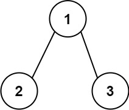
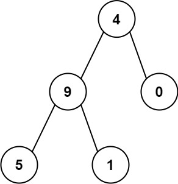

# 129. 求根节点到叶节点数字之和 <Badge type="warning" text="Medium" />

给你一个二叉树的根节点 root ，树中每个节点都存放有一个 0 到 9 之间的数字。

每条从根节点到叶节点的路径都代表一个数字：

例如，从根节点到叶节点的路径 1 -> 2 -> 3 表示数字 123 。

计算从根节点到叶节点生成的 所有数字之和 。

叶节点 是指没有子节点的节点。

>示例 1:  
输入：root = [1,2,3]  
输出：25  
解释：  
从根到叶子节点路径 1->2 代表数字 12  
从根到叶子节点路径 1->3 代表数字 13  
因此，数字总和 = 12 + 13 = 25



>示例 2:  
输入：root = [4,9,0,5,1]  
输出：1026  
解释：  
从根到叶子节点路径 4->9->5 代表数字 495  
从根到叶子节点路径 4->9->1 代表数字 491  
从根到叶子节点路径 4->0 代表数字 40  
因此，数字总和 = 495 + 491 + 40 = 1026



## 解题思路

输入： 一个二叉树的根节点 `root`。

输出： 计算从根节点到叶结点生成的所有数字之和。

本题属于**自顶向下 DFS + 路径记录**问题。

* 我们可以通过定义一个递归的深度优先遍历函数 `dfs`
* 在遍历的过程中判断是否是叶子结点
* 是的话则返回总和 `num * 10 + node.val`
* 不是的话继续递归左右子树路径数字并将当前统计的了路径数字传递下去

关键点在于计算根节点到叶子结点的路径数字 `dfs(node.left, num * 10 + node.val)`

## 代码实现

::: code-group

```python
class Solution:
    def sumNumbers(self, root: Optional[TreeNode]) -> int:
        # 定义DFS函数，参数 node 表示当前节点，num 表示从根到当前节点路径形成的数字
        def dfs(node, num):
            # 如果当前节点为空，返回0（没有形成完整数字）
            if not node:
                return 0
            
            # 如果当前节点是叶子节点，则返回从根到该叶子节点的数字
            if not node.left and not node.right:
                return num * 10 + node.val
            
            # 递归计算左子树和右子树的路径和
            left_sum = dfs(node.left, num * 10 + node.val)
            right_sum = dfs(node.right, num * 10 + node.val)
            
            # 返回左右子树的路径和之和
            return left_sum + right_sum
        
        # 从根节点开始DFS，初始路径值为0
        return dfs(root, 0)
```

```javascript
/**
 * @param {TreeNode} root
 * @return {number}
 */
var sumNumbers = function(root) {
    function dfs(node, num) {
        if (!node) return 0;

        if (!node.left && !node.right) {
            return num * 10 + node.val;
        }

        const leftSum = dfs(node.left, num * 10 + node.val);
        const rightSum = dfs(node.right, num * 10 + node.val);

        return leftSum + rightSum;
    }

    return dfs(root, 0);
};
```

:::

## 复杂度分析

时间复杂度：O(n)

空间复杂度：O(h)，h 为树的高度

## 链接

[129 国际版](https://leetcode.com/problems/sum-root-to-leaf-numbers/description/)

[129 中文版](https://leetcode.com/problems/sum-root-to-leaf-numbers/description/)
