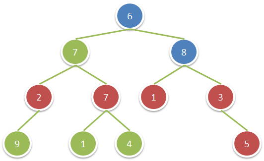

# 1315. 祖父节点值为偶数的节点和 <Badge type="warning" text="Medium" />

给你一棵二叉树，请你返回满足以下条件的所有节点的值之和：

该节点的祖父节点的值为偶数。（一个节点的祖父节点是指该节点的父节点的父节点。）

如果不存在祖父节点值为偶数的节点，那么返回 0 。

>示例 1:  
输入：root = [6,7,8,2,7,1,3,9,null,1,4,null,null,null,5]. 
输出：18. 
解释：图中红色节点的祖父节点的值为偶数，蓝色节点为这些红色节点的祖父节点。



## 解题思路

输入： 一个二叉树的根节点 `root`。

输出： 返回在满足祖父节点是偶数的情况下，各个节点的总和

本题属于**自顶向下 DFS**问题。

我们需要先找出拥有祖父节点并且祖父节点还是偶数的节点，然后将它们的总和相加并返回

我们可以将**父节点**和**祖父节点**当成参数在遍历中一起传递下去，每层传递都更新父节点和祖父节点

当发现祖父节点是偶数的时候，我们就记录当前节点的值，然后继续向下递归当前节点的子节点

如果祖父节点不是偶数，我们就标记当前节点的值为 0，因为无需记录，然后继续递归

最后返回 `当前节点记录的值 + 左子树记录的值 + 右子树记录的值` 就是答案

## 代码实现

::: code-group

```python
class Solution:
    def sumEvenGrandparent(self, root: Optional[TreeNode]) -> int:
        def dfs(node, parent, grandparent):
            if not node:
                return 0

            # 如果祖父节点存在且值为偶数，加上当前节点的值
            val = node.val if grandparent and grandparent % 2 == 0 else 0

            # 递归处理左右子树，同时更新父节点和祖父节点
            left = dfs(node.left, node.val, parent)
            right = dfs(node.right, node.val, parent)

            return val + left + right

        # 初始时父节点和祖父节点都不存在
        return dfs(root, None, None)
```

```javascript
/**
 * @param {TreeNode} root
 * @return {number}
 */
var sumEvenGrandparent = function(root) {
    function dfs(node, p, gp) {
        if (!node) return 0;

        const val = gp && gp % 2 == 0 ? node.val : 0;

        const left = dfs(node.left, node.val, p);
        const right = dfs(node.right, node.val, p);

        return val + left + right;
    }

    return dfs(root, null, null);
};
```

:::

## 复杂度分析

时间复杂度：O(n)

空间复杂度：O(h)，h 为树的高度

## 链接

[1315 国际版](https://leetcode.com/problems/sum-of-nodes-with-even-valued-grandparent/description/)

[1315 中文版](https://leetcode.cn/problems/sum-of-nodes-with-even-valued-grandparent/description/)
