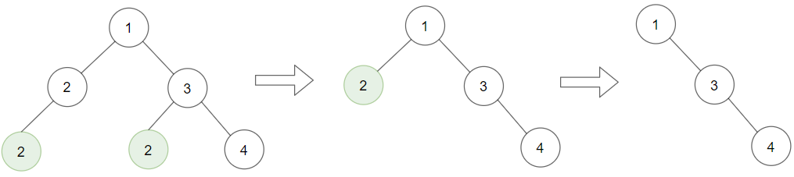
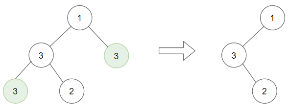

# 1325. 删除给定值的叶子节点 <Badge type="warning" text="Medium" />

给你一棵以 `root` 为根的二叉树和一个整数 `target` ，请你删除所有值为 `target` 的 叶子节点 。

注意，一旦删除值为 `target` 的叶子节点，它的父节点就可能变成叶子节点；如果新叶子节点的值恰好也是 `target` ，那么这个节点也应该被删除。

也就是说，你需要重复此过程直到不能继续删除。

>示例 1:  
输入：root = [1,2,3,2,null,2,4], target = 2 
输出：[1,null,3,null,4]  
解释：   
上面左边的图中，绿色节点为叶子节点，且它们的值与 target 相同（同为 2 ），它们会被删除，得到中间的图。   
有一个新的节点变成了叶子节点且它的值与 target 相同，所以将再次进行删除，从而得到最右边的图。   



>示例 2:  
输入：root = [1,3,3,3,2], target = 3   
输出：[1,3,null,null,2]



>示例 3:  
输入：root = [1,2,null,2,null,2], target = 2  
输出：[1]  
解释：每一步都删除一个绿色的叶子节点（值为 2）。


## 解题思路

输入： 一个二叉树的根节点 `root`。

输出： 返回移除了所有不包含 `target` 的叶子节点的原二叉树。

本题属于**自底向上 DFS + 剪枝**问题。

这题与 814 题剪枝解法一样

对于每个节点：
* 递归处理左子树，删除值为 `target` 的叶节点。
* 递归处理右子树，删除值为 `target` 的叶节点。
* 检查当前节点是否为叶节点（左右子节点均为 None）且值等于 `target`：
* 如果是，返回 `None`（删除当前节点）。
* 否则，返回当前节点（保留）。

因为递归执行顺序是向上递归的，所以我们会从子节点开始判断最后回到父节点再判断，从而做到从叶子结点处理到根节点的顺序

## 代码实现

::: code-group

```python
class Solution:
    def removeLeafNodes(self, root: Optional[TreeNode], target: int) -> Optional[TreeNode]:
        def dfs(node):
            if not node:
                return None  # 空节点直接返回

            # 递归处理左右子树
            node.left = dfs(node.left)
            node.right = dfs(node.right)

            # 如果当前节点是叶子节点，且值等于 target，则删除（返回 None）
            if not node.left and not node.right and node.val == target:
                return None

            # 否则保留当前节点
            return node

        return dfs(root)
```

```javascript
/**
 * @param {TreeNode} root
 * @param {number} target
 * @return {TreeNode}
 */
var removeLeafNodes = function(root, target) {
    function dfs(node) {
        if (!node) return null;

        node.left = dfs(node.left);
        node.right = dfs(node.right);

        if (node.val == target && !node.left && !node.right)
            return null;

        return node;
    }  

    return dfs(root);
};
```

:::

## 复杂度分析

时间复杂度：O(n)

空间复杂度：O(h)，h 为树的高度

## 链接

[1325 国际版](https://leetcode.com/problems/delete-leaves-with-a-given-value/description/)

[1325 中文版](https://leetcode.cn/problems/delete-leaves-with-a-given-value/description/)
