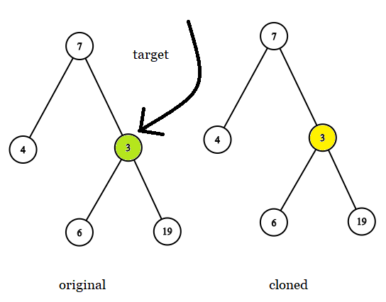
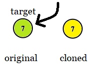
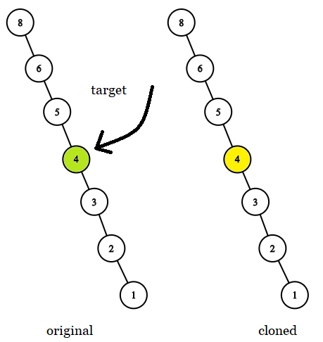

# 1379. 找出克隆二叉树中的相同节点 <Badge type="tip" text="Easy" />

给你两棵二叉树，原始树 `original` 和克隆树 `cloned`，以及一个位于原始树 `original` 中的目标节点 `target`。

其中，克隆树 `cloned` 是原始树 `original` 的一个 副本 。

请找出在树 `cloned` 中，与 `target` 相同 的节点，并返回对该节点的引用（在 C/C++ 等有指针的语言中返回 节点指针，其他语言返回节点本身）。

注意：你 不能 对两棵二叉树，以及 `target` 节点进行更改。只能 返回对克隆树 `cloned` 中已有的节点的引用。

>示例 1:  
输入: tree = [7,4,3,null,null,6,19], target = 3  
输出: 3  
解释: 上图画出了树 original 和 cloned。target 节点在树 original 中，用绿色标记。答案是树 cloned 中的黄颜色的节点（其他示例类似）。



>示例 2:  
输入: tree = [7], target =  7  
输出: 7



>示例 3:  
输入: tree = [8,null,6,null,5,null,4,null,3,null,2,null,1], target = 4  
输出: 4



## 解题思路

输入： 一个二叉树 `original` 和 克隆树 `cloned`。

输出： 返回克隆树只与原二叉树相同的 `target` 节点。

本题属于**自底向上 DFS**问题。

我们只需要按照相同的顺序递归遍历原二叉树的节点，当找到 `target` 直接返回克隆树的当前节点就是答案

## 代码实现

::: code-group

```python
class Solution:
    def getTargetCopy(self, original: TreeNode, cloned: TreeNode, target: TreeNode) -> TreeNode:
        def dfs(o, c):
            # 如果原树节点为空，返回 None（终止条件）
            if not o:
                return None

            # 找到目标节点，返回克隆树中的对应节点
            if o == target:
                return c

            # 递归在左子树查找
            left = dfs(o.left, c.left)
            if left:
                return left  # 如果左子树找到了就直接返回

            # 否则在右子树查找
            return dfs(o.right, c.right)

        return dfs(original, cloned)
```

```javascript
/**
 * @param {TreeNode} original
 * @param {TreeNode} cloned
 * @param {TreeNode} target
 * @return {TreeNode}
 */

var getTargetCopy = function(original, cloned, target) {
    function dfs(c, o) {
        if (!c) return null;

        if (c == target) return o;

        return dfs(c.left, o.left) || dfs(c.right, o.right);
    }

    return dfs(original, cloned);
};
```

:::

## 复杂度分析

时间复杂度：O(n)

空间复杂度：O(h)，h 为树的高度

## 链接

[1379 国际版](https://leetcode.com/problems/sum-of-nodes-with-even-valued-grandparent/description/)

[1379 中文版](https://leetcode.cn/problems/sum-of-nodes-with-even-valued-grandparent/description/)
