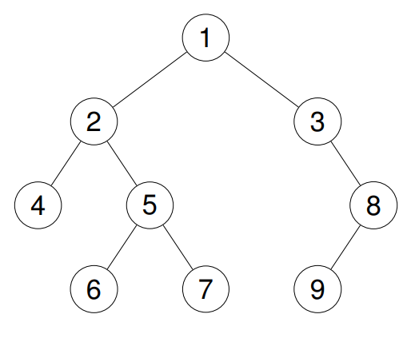

# 144. 二叉树的前序遍历 <Badge type="tip" text="Easy" />

给你二叉树的根节点 `root` ，返回它节点值的 前序 遍历。


>示例 1:  
输入：root = [1,null,2,3]  
输出：[1,2,3]



>示例 2:  
输入：root = [1,2,3,4,5,null,8,null,null,6,7,9]  
输出：[1,2,4,5,6,7,3,8,9]

>示例 3:  
输入：root = []  
输出：[]

## 解题思路

输入： 一个二叉树的根节点 root。

输出： 返回节点值的前序遍历。

本题属于**遍历二叉树**问题。

前序遍历的访问顺序是：根节点 → 左子树 → 右子树

我们可以通过定义一个递归的深度优先遍历函数 `dfs`，在每次递归进入节点时立刻记录其值，从而实现前序遍历。

## 代码实现

::: code-group

```python
class Solution:
    def preorderTraversal(self, root: Optional[TreeNode]) -> List[int]:
        # 用于存储遍历结果
        res = []

        # 定义递归函数，执行前序遍历：根 -> 左 -> 右
        def dfs(node: Optional[TreeNode]):
            if node is None:
                return

            res.append(node.val)     # 记录当前节点
            dfs(node.left)           # 递归遍历左子树
            dfs(node.right)          # 递归遍历右子树

        # 从根节点开始遍历
        dfs(root)

        return res
```

```javascript
const preorderTraversal = function(root) {
    // 用于存储遍历结果
    const res = [];

    // 定义递归函数，执行前序遍历：根 -> 左 -> 右
    function dfs(node) {
        if (!node) return;

        // 记录当前节点
        res.push(node.val);
        // 递归遍历左子树
        dfs(node.left);
        // 递归遍历右子树
        dfs(node.right);
    }

    dfs(root);
    return res;
};
```

:::

## 复杂度分析

时间复杂度：O(n)

空间复杂度：O(h)，h 为树的高度

## 链接

[144 国际版](https://leetcode.com/problems/binary-tree-preorder-traversal/description/)

[144 中文版](https://leetcode.cn/problems/binary-tree-preorder-traversal/description/)
