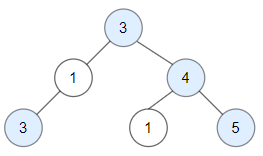
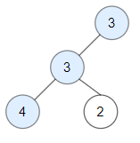

# 1448. 统计二叉树中好节点的数目 <Badge type="warning" text="Medium" />

给你一棵根为 root 的二叉树，请你返回二叉树中好节点的数目。

「好节点」X 定义为：从根到该节点 X 所经过的节点中，没有任何节点的值大于 X 的值。

>示例 1:  
输入：root = [3,3,null,4,2]  
输出：3  
解释：节点 2 -> (3, 3, 2) 不是好节点，因为 "3" 比它大。



>示例 2:  
输入：root = [1]  
输出：1  
解释：根节点是好节点。



## 解题思路

输入： 一个二叉树的根节点 `root`。

输出： 返回这棵树中 “好节点” 的个数

本题属于**自顶向下 DFS**问题。

我们可以在遍历的同时将上一个最大值 `max_val` 传递下去

当 `node.val >= max_val` 时，好节点计数 `good = 1`，否则 `good = 0`

继续遍历左右子树，最后返回 `good + left_good + right_good` 就得到答案

## 代码实现

::: code-group

```python
class Solution:
    def goodNodes(self, root: TreeNode) -> int:
        """
        统计二叉树中好节点的数量
        好节点的定义：从根到该节点的路径上，没有节点的值大于该节点的值
        """
        def dfs(node, max_val):
            if not node:
                return 0  # 空节点直接返回0
            
            # 当前节点是否是好节点
            good = 1 if node.val >= max_val else 0
            # 更新路径上的最大值
            max_val = max(max_val, node.val)
            
            # 分别计算左子树和右子树中的好节点数量
            left_good = dfs(node.left, max_val)
            right_good = dfs(node.right, max_val)
            
            # 返回总和
            return good + left_good + right_good

        return dfs(root, root.val)
```

```javascript
/**
 * @param {TreeNode} root
 * @return {number}
 */
var goodNodes = function(root) {
    function dfs(node, maxVal) {
        if (!node) return 0;

        const good = node.val >= maxVal ? 1 : 0;
        const newMaxVal = Math.max(maxVal, node.val);

        const leftGood = dfs(node.left, newMaxVal);
        const rightGood = dfs(node.right, newMaxVal);

        return good + leftGood + rightGood;
    }

    return dfs(root, root.val);
};
```

:::

## 复杂度分析

时间复杂度：O(n)

空间复杂度：O(h)，h 为树的高度

## 链接

[1448 国际版](https://leetcode.com/problems/count-good-nodes-in-binary-tree/description/)

[1448 中文版](https://leetcode.cn/problems/count-good-nodes-in-binary-tree/description/)
