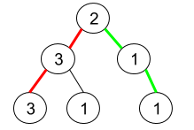
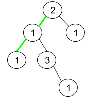

# 1457. 二叉树中的伪回文路径 <Badge type="warning" text="Medium" />

给你一棵二叉树，每个节点的值为 1 到 9 。我们称二叉树中的一条路径是 「伪回文」的，当它满足：路径经过的所有节点值的排列中，存在一个回文序列。

请你返回从根到叶子节点的所有路径中 伪回文 路径的数目。

>示例 1:  
输入：root = [2,3,1,3,1,null,1]  
输出：2   
解释：上图为给定的二叉树。总共有 3 条从根到叶子的路径：红色路径 [2,3,3] ，绿色路径 [2,1,1] 和路径 [2,3,1] 。  
在这些路径中，只有红色和绿色的路径是伪回文路径，因为红色路径 [2,3,3] 存在回文排列 [3,2,3] ，绿色路径 [2,1,1] 存在回文排列 [1,2,1] 。



>示例 2:  
输入：root = [2,1,1,1,3,null,null,null,null,null,1]   
输出：1   
解释：上图为给定二叉树。总共有 3 条从根到叶子的路径：绿色路径 [2,1,1] ，路径 [2,1,3,1] 和路径 [2,1] 。  
这些路径中只有绿色路径是伪回文路径，因为 [2,1,1] 存在回文排列 [1,2,1] 。



>示例 3:  
输入：root = [9]  
输出：1

## 解题思路

输入： 一个二叉树的根节点 `root`，里面的值都是 1 - 9。

输出： 返回这棵树的 “伪回文” 路径的数目。

本题属于**自顶向下 DFS**问题。

这道题的关键在于要判断 “伪回文”，要想满足回文路径就需要保证集合里的值最多只能有一个是奇数个

我们可以 `自顶向下` 遍历二叉树记录路径，可以用数组也可以用 `set`

这里可以用 `set` 来判断当前值是否已经出现过一次，如果出现过则移除，如果没有在 `set` 中则添加进去

当访问到叶子节点时判断 `len(set) <= 1` ，满足条件就是伪回文路径并返回 1，否则返回 0

## 代码实现

::: code-group

```python
class Solution:
    def pseudoPalindromicPaths(self, root: Optional[TreeNode]) -> int:
        def dfs(node, odd_set):
            if not node:
                return 0
            
            # 如果当前节点值已经在集合中，说明已经出现过一次（变为偶数次），移除
            # 否则添加进集合，代表奇数次
            if node.val in odd_set:
                odd_set.remove(node.val)
            else:
                odd_set.add(node.val)
            
            # 如果是叶子节点
            if not node.left and not node.right:
                # 伪回文条件：最多只有一个数字出现了奇数次
                return 1 if len(odd_set) <= 1 else 0
            
            # 注意：为了避免 left 和 right 共用同一个集合，必须创建副本
            left_count = dfs(node.left, set(odd_set))
            right_count = dfs(node.right, set(odd_set))
            
            return left_count + right_count
        
        # 初始传入空集合，代表当前路径上没有数字
        return dfs(root, set())
```

```javascript
/**
 * @param {TreeNode} root
 * @return {number}
 */
var pseudoPalindromicPaths  = function(root) {
    function dfs(node, oddSet) {
        if (!node) return 0;

        if (oddSet.has(node.val)) {
            oddSet.delete(node.val);
        } else {
            oddSet.add(node.val);
        }

        if (!node.left && !node.right) {
            return oddSet.size <= 1 ? 1 : 0;
        }

        const left = dfs(node.left, new Set(oddSet));
        const right = dfs(node.right, new Set(oddSet));

        return left + right;
    }

    return dfs(root, new Set());
};
```

:::

## 复杂度分析

时间复杂度：O(n)

空间复杂度：O(h)，h 为树的高度

## 链接

[1457 国际版](https://leetcode.com/problems/count-good-nodes-in-binary-tree/description/)

[1457 中文版](https://leetcode.cn/problems/count-good-nodes-in-binary-tree/description/)
