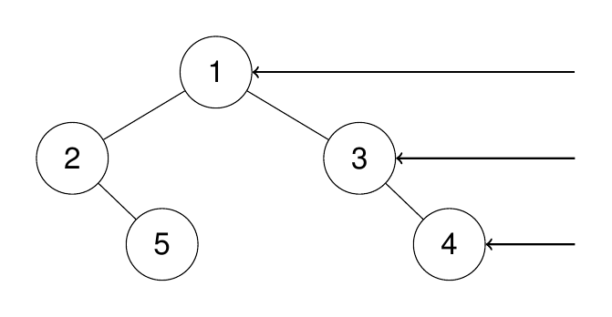

# 199. 二叉树的右视图 <Badge type="warning" text="Medium" />

给定一个二叉树的 根节点 root，想象自己站在它的右侧，按照从顶部到底部的顺序，返回从右侧所能看到的节点值。

>示例 1:  
输入：root = [1,2,3,null,5,null,4]  
输出：[1,3,4]



>示例 2:  
输入：root = [1,2,3,4,null,null,null,5]  
输出：[1,3,4,5]


>示例 3:  
输入：root = [1,null,3]  
输出：[1,3]

>示例 4:  
输入：root = []  
输出：[]

## 解题思路

**输入**：一个二叉树的根节点 `root`

**输出**：返回这棵树的右视图（每层最右边的节点）

本题属于**自顶向下的 DFS**问题。

要获取一棵树的右视图，可以采用先遍历右子树的顺序。我们利用一个列表来存储每一层最先到达的节点（最右边的节点）。遍历过程中：

* 如果当前深度等于结果列表的长度，说明是该层第一个访问到的节点（即最右边的节点），将其加入结果中。
* 先递归遍历右子树，再递归遍历左子树，这样可以确保先记录右侧的节点。

这样可以保证每层第一个被访问到的节点就是右视图看到的节点。

## 代码实现

::: code-group

```python
class Solution:
    def rightSideView(self, root: Optional[TreeNode]) -> List[int]:
        """
        返回二叉树的右视图
        思路：DFS，优先遍历右子树，每层只记录最先访问到的节点
        """
        ans = []  # 存储每一层最右边的节点

        def dfs(node, depth):
            """
            深度优先遍历二叉树
            node: 当前节点
            depth: 当前深度（从0开始）
            """
            if not node:
                return  # 空节点直接返回

            # 如果当前深度和结果列表长度相等，说明这是该层第一个访问到的节点（最右边）
            if depth == len(ans):
                ans.append(node.val)

            # 先遍历右子树，再遍历左子树
            dfs(node.right, depth + 1)
            dfs(node.left, depth + 1)
        
        dfs(root, 0)
        return ans
```

```javascript
/**
 * @param {TreeNode} root
 * @return {number[]}
 */
var rightSideView = function(root) {
    const ans = [];

    function dfs(node, depth) {
        if (!node) return;

        if (depth == ans.length) {
            ans.push(node.val);
        }

        dfs(node.right, depth + 1);
        dfs(node.left, depth + 1);
    }

    dfs(root, 0);
    return ans;
};
```

:::

## 复杂度分析

时间复杂度：O(n)

空间复杂度：O(h)

## 链接

[199 国际版](https://leetcode.com/problems/binary-tree-right-side-view/description/)

[199 中文版](https://leetcode.cn/problems/binary-tree-right-side-view/description/)
