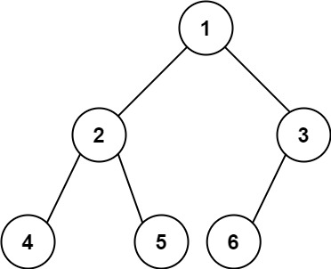

# 222. 完全二叉树的节点个数 <Badge type="tip" text="Easy" />

给你一棵 完全二叉树 的根节点 root ，求出该树的节点个数。

完全二叉树 的定义如下：在完全二叉树中，除了最底层节点可能没填满外，其余每层节点数都达到最大值，并且最下面一层的节点都集中在该层最左边的若干位置。若最底层为第 h 层（从第 0 层开始），则该层包含 1~ 2h 个节点。

>示例 1:  
输入：root = [1,2,3,4,5,6]   
输出：6



>示例 2:  
输入：root = []   
输出：0

>示例 3:  
输入：root = [1]   
输出：1

## 解题思路

**输入：** 一个完全二叉树的根节点 `root`。

**输出：** 要求在时间复杂度低于 O(n) 的情况下计算出树的节点个数

本题属于**遍历二叉树**问题。

我们可以利用“完全二叉树”的结构特性把复杂度从 `O(n)` 降到 `O((log n)^2)`：
- 若一棵树的左高（一路往左的深度）等于右高（一路往右的深度），说明它是满二叉树，节点数直接是 `2^h - 1`。
- 否则就不是满的，递归统计：`1 + 左子树节点数 + 右子树节点数`。

因为完全二叉树保证了子树要么是满的，要么仍是完全的，因此每层都能用“是否满树”的快速判断来剪枝。

## 代码实现

::: code-group

```python
class Solution:
    def countNodes(self, root: Optional[TreeNode]) -> int:
        # 定义计算左子树高度的函数
        def leftHeight(node):
            h = 0  # 初始化高度为0
            while node:  # 沿着左子节点一直向下
                h += 1  # 高度加1
                node = node.left
            return h  # 返回左子树高度

        # 定义计算右子树高度的函数
        def rightHeight(node):
            h = 0  # 初始化高度为0
            while node:  # 沿着右子节点一直向下
                h += 1  # 高度加1
                node = node.right
            return h  # 返回右子树高度
        
        # 计算当前树的左子树和右子树高度
        lh = leftHeight(root)
        rh = rightHeight(root)

        # 如果左子树高度等于右子树高度，说明是完美二叉树
        if lh == rh:
            return 2 ** lh - 1  # 完美二叉树的节点数公式：2^高度 - 1
        
        # 如果不是完美二叉树，递归计算左右子树的节点数并加上根节点
        return 1 + self.countNodes(root.left) + self.countNodes(root.right)
```

```javascript
var countNodes = function(root) {
    function leftHeight(node) {
        let h = 0;
        while (node) {
            h ++;
            node = node.left;
        }

        return h;
    }
    function rightHeight(node) {
        let h = 0;
        while (node) {
            h ++;
            node = node.right;
        }

        return h;
    }

    const lh = leftHeight(root);
    const rh = rightHeight(root);

    if (lh === rh) return 2 ** lh - 1;

    return 1 + countNodes(root.left) + countNodes(root.right);
};
```

:::

## 复杂度分析

时间复杂度：O((log n)^2)

空间复杂度：O(logn)

## 链接

[222 国际版](https://leetcode.com/problems/binary-tree-postorder-traversal/description/)

[222 中文版](https://leetcode.cn/problems/binary-tree-postorder-traversal/description/)
