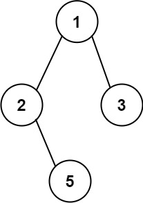

# 257. 二叉树的所有路径 <Badge type="tip" text="Easy" />

给你一个二叉树的根节点 `root` ，按 任意顺序 ，返回所有从根节点到叶子节点的路径。

叶子节点 是指没有子节点的节点。



>示例 1:  
输入：root = [1,2,3,null,5]  
输出：["1->2->5","1->3"]

>示例 2:  
输入：root = [1]  
输出：["1"]

## 解题思路

输入： 一个二叉树的根节点 `root`。

输出： 返回任意顺序的从根节点到叶子结点的路径。

本题属于**深度优先遍历（DFS）+ 路径记录 + 回溯**问题。

**方法一：递归 DFS + 回溯**

利用 DFS 的特点，在递归过程中用一个数组 path 实时记录当前路径。

* 每访问一个节点，就将该节点加入路径；
* 若当前节点是叶子节点，则将 path 拼接成字符串后加入结果集；
* 遍历完当前节点的左右子树后，使用 path.pop() 回溯，撤销当前选择；
* 按顺序递归左子树和右子树，最终得到所有从根到叶子的路径。

**方法二：迭代 DFS（用栈模拟递归）**

我们可以使用栈来模拟 DFS 过程，避免递归调用。

* 初始化栈，元素为 (当前节点, 当前路径字符串) 的元组；
* 每次从栈中弹出一个节点及其路径：
* 如果是叶子节点，则将路径加入结果集；
* 否则将其右子节点和左子节点依次压入栈，并拼接好路径字符串；
* 由于栈是先进后出结构，为了保持“先左后右”的遍历顺序，右子节点先入栈，左子节点后入栈。

## 代码实现

::: code-group

```python
class Solution:
    def binaryTreePaths(self, root: Optional[TreeNode]) -> List[str]:
        # ============ 循环写法 ================ #
        if not root:
            return []

        res = []  # 存储所有路径结果
        stack = [(root, str(root.val))]  # 初始栈：节点 + 当前路径字符串

        while stack:
            node, path = stack.pop()

            # 如果是叶子节点，加入结果列表
            if not node.left and not node.right:
                res.append(path)

            # 注意：先压右子树，再压左子树，这样左子树会先处理（模拟递归顺序）
            if node.right:
                stack.append((node.right, path + '->' + str(node.right.val)))
            if node.left:
                stack.append((node.left, path + '->' + str(node.left.val)))

        return res

        # ============ 递归写法 ================ #

        ans = []  # 用于存储所有路径结果
        path = []  # 临时路径记录

        def dfs(node):
            if not node:
                return  # 遇到空节点直接返回
            
            # 将当前节点值加入路径（转为字符串）
            path.append(str(node.val))

            # 如果是叶子节点，构造路径字符串并加入结果
            if not node.left and not node.right:
                ans.append('->'.join(path))

            # 继续递归遍历左右子树
            dfs(node.left)
            dfs(node.right)

            # 回溯：撤销本次递归对路径的修改
            path.pop()
        
        # 从根节点开始 DFS
        dfs(root)

        return ans
```

```javascript
    // ======= 循环写法 =====

    // 存储所有路径结果
    const ans = [];
    // 初始栈：节点 + 当前路径字符串
    const stack = [[root, String(root.val)]];

    while (stack.length) {
        const [node, path] = stack.pop();

        // 如果是叶子节点，加入结果列表
        if (!node.left && !node.right) 
            ans.push(path);

        // 注意：先压右子树，再压左子树，这样左子树会先处理（模拟递归顺序）
        if (node.right) 
            stack.push([node.right, path + '->' + String(node.right.val)]);

        if (node.left) 
            stack.push([node.left, path + '->' + String(node.left.val)])
    }

    return ans;

    // ======= 递归写法 =======

    // 用于存储所有路径结果
    const ans = [];
    // 临时路径记录
    const path = [];

    function dfs(node) {
        // 遇到空节点直接返回
        if (!node) return;

        // 将当前节点值加入路径
        path.push(node.val);

        // 如果是叶子节点，构造路径字符串并加入结果
        if (!node.left && !node.right) 
            ans.push(path.join('->'));

        // 继续递归遍历左右子树
        dfs(node.left)
        dfs(node.right)

        // 回溯：撤销本次递归对路径的修改
        path.pop();
    }

    // 从根节点开始 DFS
    dfs(root)
    return ans;
```

:::

## 复杂度分析

时间复杂度：O(n)

空间复杂度：O(h)，h 为树的高度

## 链接

[257 国际版](https://leetcode.com/problems/binary-tree-paths/description/)

[257 中文版](https://leetcode.com/problems/binary-tree-paths/description/)
