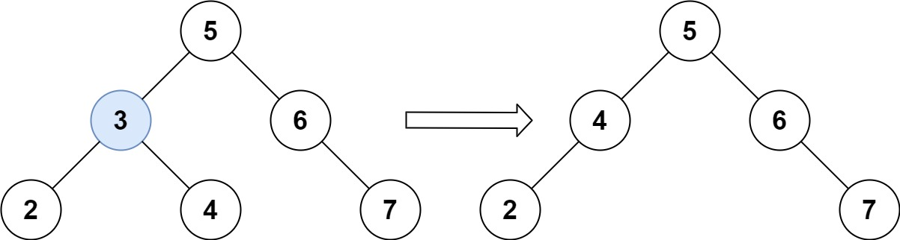
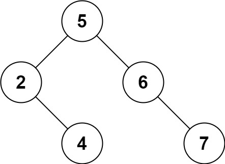

# 450. 删除二叉搜索树中的节点 <Badge type="warning" text="Medium" />

给定一个二叉搜索树的根节点 `root` 和一个值 `key`，删除二叉搜索树中的 key 对应的节点，并保证二叉搜索树的性质不变。返回二叉搜索树（有可能被更新）的根节点的引用。

一般来说，删除节点可分为两个步骤：  
1. 首先找到需要删除的节点；
2. 如果找到了，删除它。

>示例 1:   
输入：root = [5,3,6,2,4,null,7], key = 3   
输出：[5,4,6,2,null,null,7]   
解释：给定需要删除的节点值是 3，所以我们首先找到 3 这个节点，然后删除它。   
一个正确的答案是 [5,4,6,2,null,null,7], 如下图所示。   
另一个正确答案是 [5,2,6,null,4,null,7]。



>示例 2:   
输入: root = [5,3,6,2,4,null,7], key = 0   
输出: [5,3,6,2,4,null,7]   
解释: 二叉树不包含值为 0 的节点



>示例 3:   
输入: root = [], key = 0   
输出: []

## 解题思路

**输入**：二叉搜索树（BST）的根节点 `root` 和一个值 `key`

**输出**：删除 key 对应的节点并保证二叉树搜索树的性质，返回有可能被更新的根结点的引用

本题适合利用**二叉搜索树（BST）的性质**结合**自底向上的 DFS**解决。

1. 查找节点
- 和普通 BST 的查找一样：
- 如果 key < root.val → 去左子树找
- 如果 key > root.val → 去右子树找
- 如果 key == root.val → 找到了，进入删除逻辑

2. 删除节点

- 删除逻辑要分情况讨论：
- 目标节点没有子节点（叶子节点）
- 直接返回 None，把它删除即可。

- 只有一个子节点（左或右）
- 返回那个非空的子节点，用它“顶替”当前节点。

- 有两个子节点（最复杂情况）
- 找到中序后继（右子树的最小节点）或中序前驱（左子树的最大节点）；
- 用它的值替换当前节点；
- 然后递归地在对应子树中删除那个后继/前驱节点。

这样既保证了 BST 的有序性，也完成了删除。

## 代码实现

::: code-group

```python
class Solution:
    def findmin(self, root):
        # 寻找最小值节点，即左子树中的最左节点
        while root.left:
            root = root.left
        return root
    
    def deleteNode(self, root: TreeNode, key: int) -> TreeNode:
        # 如果树为空，直接返回
        if not root:
            return root
        
        # 如果key小于当前节点值，递归去左子树查找
        elif key < root.val:
            root.left = self.deleteNode(root.left, key)
        
        # 如果key大于当前节点值，递归去右子树查找
        elif key > root.val:
            root.right = self.deleteNode(root.right, key)
        
        # 找到要删除的节点
        else:
            # 如果节点是叶子节点，直接删除
            if not root.left and not root.right:
                root = None
            
            # 如果只有右子树，没有左子树，用右子树替代
            elif not root.left:
                root = root.right
            
            # 如果只有左子树，没有右子树，用左子树替代
            elif not root.right:
                root = root.left
            
            # 如果有两个子节点
            else:
                # 找到右子树中的最小节点，用它替代当前节点
                temp = self.findmin(root.right)
                root.val = temp.val
                # 递归删除右子树中的最小节点
                root.right = self.deleteNode(root.right, temp.val)
        
        return root
```

```javascript
var deleteNode = function(root, key) {
    if (!root) return root;

    if (key > root.val) {
        root.right = deleteNode(root.right, key);
    } else if (key < root.val) {
        root.left = deleteNode(root.left, key);
    } else {
        if (!root.left) return root.right;
        if (!root.right) return root.left;

        const succ = _miniNode(root.right, key);
        root.val = succ.val;
        root.right = deleteNode(root.right, succ.val);
    }

    return root;
};

function _miniNode(node) {
    while (node.left) {
        node = node.left
    }

    return node;
}
```

:::

## 复杂度分析

时间复杂度：O(h)

空间复杂度：O(h)

## 链接

[450 国际版](https://leetcode.com/problems/delete-node-in-a-bst/description/)

[450 中文版](https://leetcode.cn/problems/delete-node-in-a-bst/description/)
