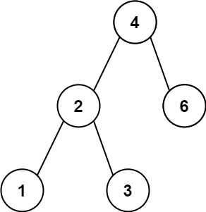
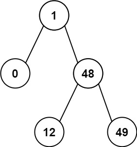

# 530. 二叉搜索树的最小绝对差 <Badge type="tip" text="Easy" />

给你一个二叉搜索树的根节点 `root` ，返回 树中任意两不同节点值之间的最小差值 。

差值是一个正数，其数值等于两值之差的绝对值。

>示例 1:   
输入：root = [4,2,6,1,3]  
输出：1



>示例 2:  
输入：root = [1,0,48,null,null,12,49]  
输出：1



## 解题思路

**输入**：二叉搜索树的根节点 `root`

**输出**：返回任意两个节点的最小绝对值之差。

这道题是一个 **二叉搜索树遍历 + 中序遍历** 问题。

根据二叉搜索树的特点，我可以利用**中序遍历**得到一个递增的顺序

在这个递增的顺序中我们就可以一步步比较相邻节点的差值，记录最小值得到答案

## 代码实现

::: code-group

```python
class Solution:
    def getMinimumDifference(self, root: Optional[TreeNode]) -> int:
        prev = None  # 记录上一个访问的节点（中序遍历的前一个节点）
        ans = float('inf')  # 初始化最小差值为无穷大

        # 中序遍历，利用BST的有序性
        def dfs(node):
            nonlocal ans, prev
            if not node:
                return
            
            # 遍历左子树
            dfs(node.left)

            # 当前节点与前一个节点的值差值更新最小值
            if prev is not None:
                ans = min(ans, node.val - prev.val)
            prev = node  # 更新前一个节点

            # 遍历右子树
            dfs(node.right)

        dfs(root)
        return ans
```

```javascript
/**
 * @param {TreeNode} root
 * @return {number}
 */
var getMinimumDifference = function(root) {
    let ans = Infinity;
    let prev = null;

    function dfs(node) {
        if (!node) return;

        dfs(node.left)
        if (prev != null)
            ans = Math.min(ans, node.val - prev.val)
        prev = node

        dfs(node.right)
    }

    dfs(root);
    return ans;
};
```

:::

## 复杂度分析

时间复杂度：O(n)

空间复杂度：O(h)

## 链接

[530 国际版](https://leetcode.com/problems/minimum-absolute-difference-in-bst/description/)

[530 中文版](https://leetcode.cn/problems/minimum-absolute-difference-in-bst/description/)
