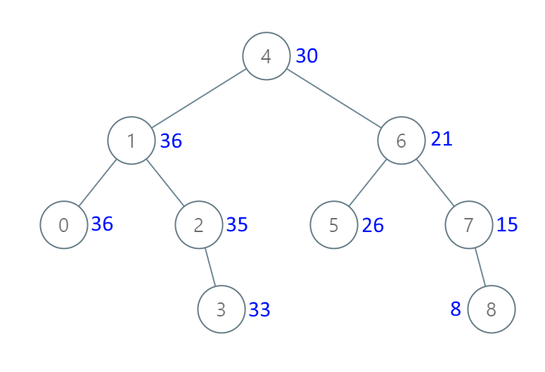

# 538. 把二叉搜索树转换为累加树 <Badge type="warning" text="Medium" />

给出二叉 搜索 树的根节点，该树的节点值各不相同，请你将其转换为累加树（Greater Sum Tree），使每个节点 `node` 的新值等于原树中大于或等于 `node.val` 的值之和。

提醒一下，二叉搜索树满足下列约束条件：

* 节点的左子树仅包含键 小于 节点键的节点。
* 节点的右子树仅包含键 大于 节点键的节点。
* 左右子树也必须是二叉搜索树。

注意：本题和 [1038](https://leetcode.com/problems/binary-search-tree-to-greater-sum-tree/) 相同

>示例 1:   
输入：[4,1,6,0,2,5,7,null,null,null,3,null,null,null,8]  
输出：[30,36,21,36,35,26,15,null,null,null,33,null,null,null,8]



>示例 2:  
输入：root = [0,null,1]  
输出：[1,null,1]

>示例 3:  
输入：root = [1,0,2]  
输出：[3,3,2]

>示例 4:  
输入：root = [3,2,4,1]   
输出：[7,9,4,10]

## 解题思路

**输入**：二叉搜索树的根节点 `root`

**输出**：将其转化成累加树并返回

这道题是属于 **二叉搜索树 + 反中序遍历** 问题。

二叉搜索树（BST）特性：**右子树的值 > 当前节点值 > 左子树的值**。

所以关键点在于要从最大值开始累加，也就是最右边的值开始，因此要从右到左遍历，也就是 **反中序遍历 (右 -> 中 -> 左)**。

因为要不断累加需要记录上一次的值，所以我们可以用一个全局变量 `total` 记录

我们先通过 `dfs(node.right)` 遍历到达最大值节点，也就是在 **“归”** 的时候开始不断累加 `total += node.val` 就是当前节点的累加值

然后再递归 `dfs(node.left)` 可以再遍历的过程中就直接累加，也就是在 **“递”** 的时候就不断累加 `total += node.val`，就是当前节点的累加值

最后直接返回根节点就是答案，所以也算是一种 **有递有归** 的类型题。

## 代码实现

::: code-group

```python
class Solution:
    def convertBST(self, root: Optional[TreeNode]) -> Optional[TreeNode]:
        total = 0  # 初始化全局变量，记录已访问节点值的累加和

        def dfs(node):
            nonlocal total  # 使用外部的 total 变量，允许在递归中修改

            if not node:
                return  # 空节点直接返回，无需处理

            # 先递归访问右子树（右子树节点值较大，确保先处理更大的值）
            dfs(node.right)

            # 处理当前节点：将当前节点值累加到 total，并更新节点值为累加和
            total += node.val  # 累加当前节点值到 total（包含当前节点值）
            node.val = total   # 更新节点值为 total（大于或等于当前节点值的和）

            # 再递归访问左子树（左子树节点值较小，继续累加）
            dfs(node.left)

        dfs(root)  # 从根节点开始处理整棵树
        return root  # 返回转换后的累加树根节点
```

```javascript
/**
 * @param {TreeNode} root
 * @return {TreeNode}
 */
var convertBST = function(root) {
    let total = 0;

    function dfs(node) {
        if (!node) return;

        dfs(node.right);

        total += node.val;
        node.val = total;

        dfs(node.left);
    }

    dfs(root);

    return root;
};
```

:::

## 复杂度分析

时间复杂度：O(n)

空间复杂度：O(n)

## 链接

[538 国际版](https://leetcode.com/problems/convert-bst-to-greater-tree/description/)

[538 中文版](https://leetcode.cn/problems/convert-bst-to-greater-tree/description/)
