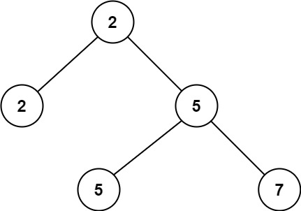
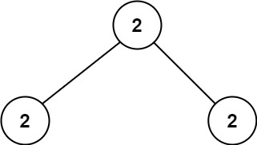

# 671. 二叉树中第二小的节点 <Badge type="tip" text="Easy" />

给定一个非空特殊的二叉树，每个节点都是正数，并且每个节点的子节点数量只能为 2 或 0。如果一个节点有两个子节点的话，那么该节点的值等于两个子节点中较小的一个。

更正式地说，即 `root.val = min(root.left.val, root.right.val)` 总成立。

给出这样的一个二叉树，你需要输出所有节点中的 第二小的值 。

如果第二小的值不存在的话，输出 -1 。

>示例 1:   
输入：root = [2,2,5,null,null,5,7]  
输出：5  
解释：最小的值是 2 ，第二小的值是 5 。



>示例 2:  
输入：root = [2,2,2]  
输出：-1  
解释：最小的值是 2, 但是不存在第二小的值。



## 解题思路

**输入**：二叉树的根节点 `root`

**输出**：返回第二小的值

这道题是一个典型的 **二叉树遍历** 问题。

题目有个特点：每个节点的子节点要么没有，要么恰好有两个，并且如果有两个子节点，那么当前节点一定是这两个子节点中值最小的（也是整棵树的最小值）。

因此，只要这棵树非空，根节点一定是最小值。

我们可以使用深度优先搜索（DFS）遍历整棵树：

* 当遇到一个节点的值大于最小值（即根节点的值）时，说明它可能是第二小的值；这时直接返回该节点的值（不需要再往下遍历子节点）。
* 如果遇到的节点值等于最小值，则继续递归遍历左右子树，查找可能的第二小值。
* 如果左右子树都找不到第二小值，则返回 `-1`。

最后，通过比较左右子树返回的结果，选择较小的那个作为第二小的值。如果都返回 `-1`，说明整棵树没有第二小的值。


## 代码实现

::: code-group

```python
class Solution:
    def findSecondMinimumValue(self, root: Optional[TreeNode]) -> int:
        # 如果根节点为空，返回 -1
        if not root:
            return -1

        # 记录树的最小值（根节点值，因为是 BST）
        smallest = root.val

        def dfs(node):
            # 如果节点为空，返回 -1
            if not node:
                return -1

            # 如果当前节点值大于最小值，当前值可能是第二小值
            if node.val > smallest:
                return node.val
            
            # 递归遍历左子树和右子树
            left = dfs(node.left)
            right = dfs(node.right)

            # 如果左右子树都返回有效值，取较小的作为候选
            if left != -1 and right != -1:
                return min(left, right)
            # 如果只有一侧有有效值，返回该值；否则返回另一侧的值
            else:
                return left if left != -1 else right
        
        # 返回第二小值
        return dfs(root)
```

```javascript
/**
 * @param {TreeNode} root
 * @return {number}
 */
var findSecondMinimumValue = function(root) {
    if (!root) return -1;

    const smallest = root.val;

    function dfs(node) {
        if (!node) return -1;

        if (node.val > smallest) return node.val;

        const left = dfs(node.left);
        const right = dfs(node.right);

        if (left !== -1 && right !== -1) {
            return Math.min(left, right);
        }

        return left == -1 ? right : left;
    }

    return dfs(root);
};
```

:::

## 复杂度分析

时间复杂度：O(n)

空间复杂度：O(h)

## 链接

[671 国际版](https://leetcode.com/problems/second-minimum-node-in-a-binary-tree/)

[671 中文版](https://leetcode.cn/problems/second-minimum-node-in-a-binary-tree/)
