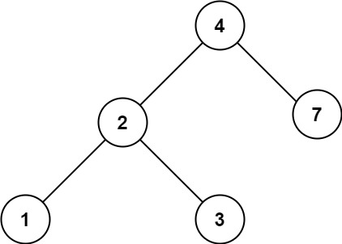

# 700. 二叉搜索树中的搜索 <Badge type="tip" text="Easy" />

给定二叉搜索树（BST）的根节点 `root` 和一个整数值 `val`。

你需要在 BST 中找到节点值等于 `val` 的节点。 返回以该节点为根的子树。 如果节点不存在，则返回 `null` 。

>示例 1:   
输入：root = [4,2,7,1,3], val = 2  
输出：[2,1,3]


>示例 2:  
输入：root = [4,2,7,1,3], val = 5  
输出：[]



## 解题思路

**输入**：二叉搜索树的根节点 `root`，一个整数 `val`

**输出**：找到值为 `val` 的节点并返回。

这道题是一个 **二叉搜索树遍历** 问题。

根据二叉搜索树的特点，当发现值比节点值小则说明在左子树，直接返回左子树遍历结果

当发现值比节点值大则说明在右子树，直接返回右子树遍历结果

直到找到值相等的节点为止，如果找到空结点还没找到，则说明不存在直接返回空节点

## 代码实现

::: code-group

```python
class Solution:
    def searchBST(self, root: Optional[TreeNode], val: int) -> Optional[TreeNode]:
        # 在二叉搜索树中查找值为 val 的节点，返回该节点为根的子树
        def dfs(node, val):
            if not node:
                return None  # 空节点，说明没找到

            if val < node.val:
                # 要找的值比当前节点小，去左子树查找
                return dfs(node.left, val)
            elif val > node.val:
                # 要找的值比当前节点大，去右子树查找
                return dfs(node.right, val)
            else:
                # 找到了值等于 val 的节点
                return node

        return dfs(root, val)
```

```javascript
/**
 * @param {TreeNode} root
 * @param {number} val
 * @return {TreeNode}
 */
var searchBST = function(root, val) {
    function dfs(node, val) {
        if (!node) return node;

        if (val < node.val) 
            return dfs(node.left, val);
        
        if (val > node.val)
            return dfs(node.right, val)
        
        return node;
    }

    return dfs(root, val);
};
```

:::

## 复杂度分析

时间复杂度：O(n)

空间复杂度：O(h)

## 链接

[700 国际版](https://leetcode.com/problems/search-in-a-binary-search-tree/description/)

[700 中文版](https://leetcode.cn/problems/search-in-a-binary-search-tree/description/)
