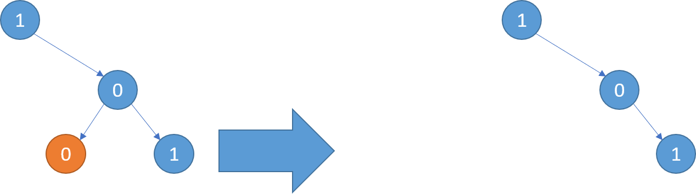
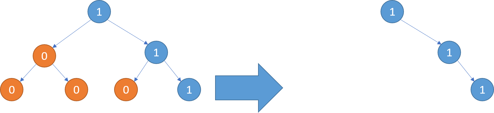
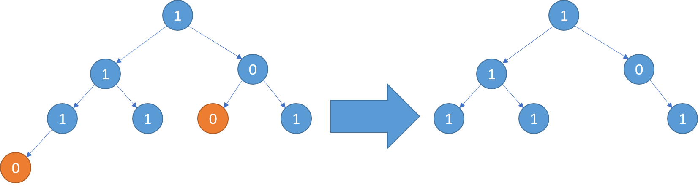

# 814. 二叉树剪枝 <Badge type="warning" text="Medium" />

给你二叉树的根结点 `root` ，此外树的每个结点的值要么是 0 ，要么是 1 。

返回移除了所有不包含 1 的子树的原二叉树。

节点 node 的子树为 node 本身加上所有 node 的后代。

>示例 1:  
输入：root = [1,null,0,0,1]. 
输出：[1,null,0,null,1]. 
解释：只有红色节点满足条件“所有不包含 1 的子树”。 右图为返回的答案。



>示例 2:  
输入：root = [1,0,1,0,0,0,1]  
输出：[1,null,1,null,1]



>示例 3:  
输入：root = [1,1,0,1,1,0,1,0]  
输出：[1,1,0,1,1,null,1]



## 解题思路

输入： 一个二叉树的根节点 `root`。

输出： 返回移除了所有不包含 `1` 的子树的原二叉树。

本题属于**自底向上 DFS + 剪枝**问题。

我们可以将问题拆解成最终 4 个子问题来看

1. 当前节点不存在则说明要剪枝 `return None`
2. 当前左节点递归判断是否存在且为 1，只要发现不满足就剪枝 `return None`
3. 当前右节点递归判断是否存在且为 1，只要发现不满足就剪枝 `return None`
4. 当前左右子节点都返回 `None` 则判断当前节点是否值为 1，如果不为 1 则也要剪枝 `return None`

所以一句话就是判断当前节点是否需要剪枝的条件就是：**判断当前节点是否为 0 并且左右子节点是否都不包含 1**

## 代码实现

::: code-group

```python
class Solution:
    def pruneTree(self, root: Optional[TreeNode]) -> Optional[TreeNode]:
        def dfs(node):
            if not node:
                return None  # 空节点，直接剪掉

            # 递归处理左右子树，返回剪枝后的子树
            node.left = dfs(node.left)
            node.right = dfs(node.right)

            # 如果当前节点值为 0 且左右子树都为空，说明整棵子树没有 1，应被剪掉
            if node.val == 0 and not node.left and not node.right:
                return None

            # 否则保留当前节点
            return node

        return dfs(root)
```

```javascript
/**
 * @param {TreeNode} root
 * @return {TreeNode}
 */
var pruneTree = function(root) {
    function dfs(node) {
        if (!node) return null;

        node.left = dfs(node.left)
        node.right = dfs(node.right)

        if (node.val === 0 && !node.left && !node.right) 
            return null;
        
        return node;
    }

    return dfs(root);
};
```

:::

## 复杂度分析

时间复杂度：O(n)

空间复杂度：O(h)，h 为树的高度

## 链接

[814 国际版](https://leetcode.com/problems/binary-tree-pruning/description/)

[814 中文版](https://leetcode.cn/problems/binary-tree-pruning/description/)
