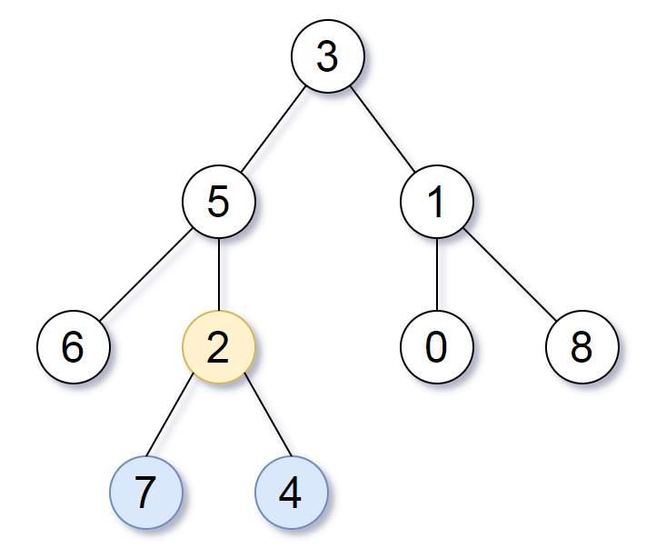

# 865. 具有所有最深节点的最小子树 <Badge type="warning" text="Medium" />

给定一个根为 `root` 的二叉树，每个节点的深度是 该节点到根的最短距离 。

返回包含原始树中所有 最深节点 的 最小子树 。

如果一个节点在 整个树 的任意节点之间具有最大的深度，则该节点是 最深的 。

一个节点的 子树 是该节点加上它的所有后代的集合。

>示例 1:  
输入：root = [3,5,1,6,2,0,8,null,null,7,4]   
输出：[2,7,4]   
解释：   
我们返回值为 2 的节点，在图中用黄色标记。  
在图中用蓝色标记的是树的最深的节点。  
注意，节点 5、3 和 2 包含树中最深的节点，但节点 2 的子树最小，因此我们返回它。



>示例 2:  
输入：root = [1]   
输出：[1]   
解释：根节点是树中最深的节点。

>示例 3:  
输入：root = [0,1,3,null,2]   
输出：[2]   
解释：树中最深的节点为 2 ，有效子树为节点 2、1 和 0 的子树，但节点 2 的子树最小。

## 解题思路

输入： 一个二叉树的根节点 `root`。

输出： 返回包含所有最深节点的最小公共祖先

本题可以用 **自顶向下 DFS** 也可以用 **自底向上** 解决。

### 自顶向下 DFS

我们可以维护两个全局变量 `ans` `max_depth` 记录答案和最大深度

* 我们向下遍历时可以将下一层深度传入，并在递归求最大深度的过程中每次都更新最大深度值
* 当判断左右子树相等并都到达最大深度的时候就是答案
* 由于最大深度只会不断递增，所以最终全部遍历过后一定可以得到整棵树的最大深度值

### 自底向上 DFS

我们可以将每颗子树都看成一个子问题，我们只需要知道：

* 这颗子树的最深叶子深度
* 这颗子树的最深叶子节点的公共祖先

分类讨论：

* 设子树的根节点为 `node`，`node` 的左子树的高度为 `leftHeight`，`node` 的右子树的高度为 `rightHeight`。
* 如果 `leftHeight > rightHeight`，那么子树的高度为 `leftHeight + 1`，lca 是左子树的 lca。
* 如果 `leftHeight < rightHeight`，那么子树的高度为 `rightHeight + 1`，lca 是右子树的 lca。
* 如果 `leftHeight = rightHeight`，那么子树的高度为 `leftHeight + 1`，lca 就是 node。反证法：如果 lca 在左子树中，那么 lca 不是右子树的最深叶结点的祖先，这不对；如果 lca 在右子树中，那么 lca 不是左子树的最深叶结点的祖先，这也不对；如果 lca 在 node 的上面，那就不符合「最近」的要求。所以 lca 只能是 node。

## 代码实现

### 自顶向下 DFS

::: code-group

```python
class Solution:
    def subtreeWithAllDeepest(self, root: Optional[TreeNode]) -> Optional[TreeNode]:
        # 记录最深的深度
        max_depth = 0
        # 最小公共子树根节点
        ans = None

        def dfs(node, depth):
            nonlocal max_depth, ans

            if not node:
                # 更新全局最大深度
                max_depth = max(max_depth, depth)
                return depth  # 空节点返回当前深度用于比较
            
            # 分别计算左右子树的最大深度
            left = dfs(node.left, depth + 1)
            right = dfs(node.right, depth + 1)

            # 如果当前节点的左右子树都达到了最大深度
            if left == right == max_depth:
                ans = node  # 当前节点即为包含所有最深节点的最小子树根

            # 返回左右子树中更深的一边
            return max(left, right)

        dfs(root, 0)
        return ans
```

```javascript
/**
 * @param {TreeNode} root
 * @return {TreeNode}
 */
var subtreeWithAllDeepest = function(root) {
    let ans = null;
    let maxDepth = 0;

    function dfs(node, depth) {
        if (!node) {
            maxDepth = Math.max(maxDepth, depth);
            return depth;
        }

        const left = dfs(node.left, depth + 1);
        const right = dfs(node.right, depth + 1);

        if (left == right && left == maxDepth)
            ans = node
        
        return Math.max(left, right);
    }

    dfs(root, 0);
    return ans;
};
```

:::

### 自底向上 DFS

::: code-group

```python
class Solution:
    def subtreeWithAllDeepest(self, root: Optional[TreeNode]) -> Optional[TreeNode]:
        # 自底向上 DFS
        # 定义一个自底向上的 DFS 函数，返回 (子树最大深度, 最深节点的最近公共祖先)
        def dfs(node):
            if not node:
                # 空节点深度为 0，没有祖先
                return 0, None
            
            # 递归左右子树，获取它们的最大深度和对应的最小公共祖先
            left_depth, left_lca = dfs(node.left)
            right_depth, right_lca = dfs(node.right)

            # 根据左右子树的深度判断：
            if left_depth > right_depth:
                # 左子树更深，返回左子树的信息，深度 +1
                return left_depth + 1, left_lca
            elif right_depth > left_depth:
                # 右子树更深，返回右子树的信息，深度 +1
                return right_depth + 1, right_lca
            else:
                # 左右深度相等，当前节点是最深节点的公共祖先
                return left_depth + 1, node

        # 返回最终的最近公共祖先节点
        return dfs(root)[1]
```

```javascript
/**
 * @param {TreeNode} root
 * @return {TreeNode}
 */
var subtreeWithAllDeepest = function(root) {
    // 自底向上 DFS
    function dfs(node) {
        if (!node) return [0, null];

        const [leftDepth, leftLca] = dfs(node.left);
        const [rightDepth, rightLca] = dfs(node.right);

        if (leftDepth < rightDepth)
            return [rightDepth + 1, rightLca];

        if (leftDepth > rightDepth)
            return [leftDepth + 1, leftLca];
        
        return [leftDepth + 1, node];
    }

    return dfs(root)[1];
}
```

:::

## 复杂度分析

时间复杂度：O(n)

空间复杂度：O(n)

## 链接

[865 国际版](https://leetcode.com/problems/smallest-subtree-with-all-the-deepest-nodes/description/)

[865 中文版](https://leetcode.cn/problems/smallest-subtree-with-all-the-deepest-nodes/description/)
