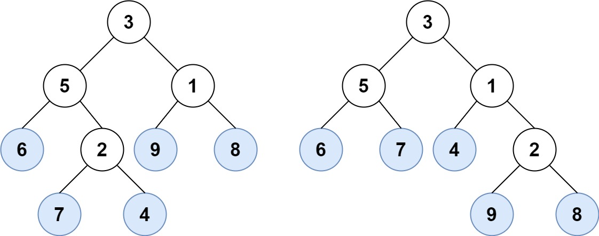
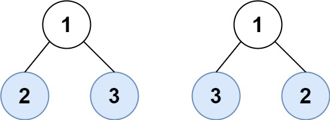

# 872. 叶子相似的树 <Badge type="tip" text="Easy" />

请考虑一棵二叉树上所有的叶子，这些叶子的值按从左到右的顺序排列形成一个 叶值序列 。


举个例子，如上图所示，给定一棵叶值序列为 (6, 7, 4, 9, 8) 的树。

如果有两棵二叉树的叶值序列是相同，那么我们就认为它们是 叶相似 的。

如果给定的两个根结点分别为 root1 和 root2 的树是叶相似的，则返回 true；否则返回 false 。

>示例 1:  
输入：root1 = [3,5,1,6,2,9,8,null,null,7,4], root2 = [3,5,1,6,7,4,2,null,null,null,null,null,null,9,8]  
输出：true



>示例 2:  
输入：root1 = [1,2,3], root2 = [1,3,2]  
输出：false



## 解题思路

输入： 两个二叉树的根节点 `root1` `root2`。

输出： 判断这两棵树的叶子结点是否相似

本题属于**遍历二叉树**问题。

我们可以通过定义一个递归的深度优先遍历函数 `dfs`，在遍历的过程中判断叶子结点并记录下来，最后判断两棵树叶子结点是否相似。

关键点在于判断叶子结点的逻辑 `if not node.left and not node.right`

## 代码实现

::: code-group

```python
class Solution:
    def leafSimilar(self, root1: Optional[TreeNode], root2: Optional[TreeNode]) -> bool:
        # 用于存储两棵树的叶子节点序列
        leaves1 = []
        leaves2 = []

        # 定义DFS函数，收集叶子节点
        def dfs(node, leaves):
            if not node:
                return
            # 如果当前节点是叶子节点，则添加到序列中
            if not node.left and not node.right:
                leaves.append(node.val)
            # 递归遍历左子树
            dfs(node.left, leaves)
            # 递归遍历右子树
            dfs(node.right, leaves)
        
        # 分别获取两棵树的叶子节点序列
        dfs(root1, leaves1)
        dfs(root2, leaves2)
        
        # 比较两个序列是否相同
        return leaves1 == leaves2
```

```javascript
/**
 * @param {TreeNode} root1
 * @param {TreeNode} root2
 * @return {boolean}
 */
var leafSimilar = function(root1, root2) {
    const leaves1 = [];
    const leaves2 = [];

    function dfs(node, leaves) {
        if (!node) return;

        if (!node.left && !node.right) {
            leaves.push(node.val);
        }

        dfs(node.left, leaves);
        dfs(node.right, leaves);
    }

    dfs(root1, leaves1);
    dfs(root2, leaves2);

    if (leaves1.length !== leaves2.length) return false;

    for (let i = 0; i < leaves1.length; i++) {
        if (leaves1[i] !== leaves2[i]) return false;
    }
    
    return true;
};
```

:::

## 复杂度分析

时间复杂度：O(n)

空间复杂度：O(h)，h 为树的高度

## 链接

[872 国际版](https://leetcode.com/problems/leaf-similar-trees/description/)

[872 中文版](https://leetcode.cn/problems/leaf-similar-trees/description/)
