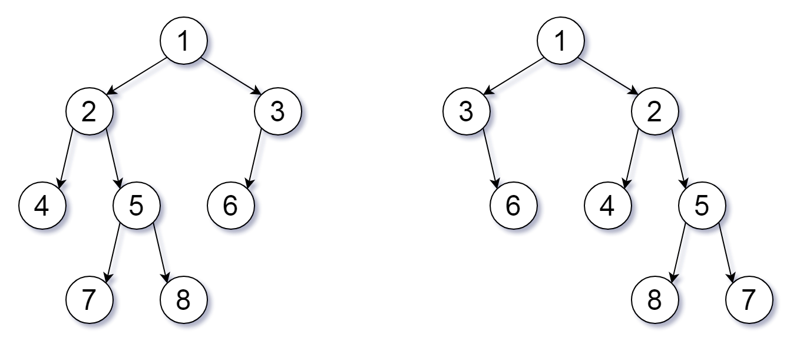

# 951. 翻转等价二叉树 <Badge type="warning" text="Medium" />

我们可以为二叉树 T 定义一个 翻转操作 ，如下所示：选择任意节点，然后交换它的左子树和右子树。

只要经过一定次数的翻转操作后，能使 X 等于 Y，我们就称二叉树 X 翻转 等价 于二叉树 Y。

这些树由根节点 `root1` 和 `root2` 给出。如果两个二叉树是否是翻转 等价 的函数，则返回 `true` ，否则返回 `false` 。

>示例 1:  
输入：root1 = [1,2,3,4,5,6,null,null,null,7,8], root2 = [1,3,2,null,6,4,5,null,null,null,null,8,7]  
输出：true  
解释：我们翻转值为 1，3 以及 5 的三个节点。



>示例 2:  
输入: root1 = [], root2 = []  
输出: true

>示例 3:  
输入: root1 = [], root2 = [1]  
输出: false

## 解题思路

输入： 一个二叉树的根节点 `root`。

输出： 判断两个二叉树是否可以通过翻转达到等价的二叉树

本题可以用 **自底向上 DFS**解决。

* 这道题的关键点在于并不是强制要求每棵子树都翻转
* 只要不翻转能得到相同的树就可以不翻转
* 如果翻转能得到相同的树才翻转
* 所以不仅要比较翻转的的结果也要比较不翻转的结果
* 满足其一即可

我们可以递归遍历的时候比较这两棵树翻转和不翻转的时候是否相等就能得出答案

## 代码实现

::: code-group

```python
class Solution:
    def flipEquiv(self, root1: Optional[TreeNode], root2: Optional[TreeNode]) -> bool:
        def dfs(node1, node2):
            # 如果两个节点都为空，说明结构一致，返回 True
            if not node1 and not node2:
                return True

            # 如果一个为空一个不为空，或值不同，则不等价
            if not node1 or not node2 or node1.val != node2.val:
                return False

            # 情况一：不翻转，左右子树对应相等
            no_flip = dfs(node1.left, node2.left) and dfs(node1.right, node2.right)

            # 情况二：翻转左右子树后相等
            flip = dfs(node1.left, node2.right) and dfs(node1.right, node2.left)

            # 只要满足一种情况即可
            return no_flip or flip

        return dfs(root1, root2)
```

```javascript
/**
 * @param {TreeNode} root1
 * @param {TreeNode} root2
 * @return {boolean}
 */
var flipEquiv = function(root1, root2) {
    function dfs(node1, node2) {
        if (node1 == null && node2 == null)
            return true;

        if (node1 == null || node2 == null || node1.val !== node2.val)
            return false;

        const noFlip = dfs(node1.left, node2.left) && dfs(node1.right, node2.right)

        const flip = dfs(node1.left, node2.right) && dfs(node1.right, node2.left)

        return noFlip || flip
    }

    return dfs(root1, root2)
};
```

## 复杂度分析

时间复杂度：O(n)

空间复杂度：O(h)，h 为树的高度

## 链接

[951 国际版](https://leetcode.com/problems/flip-equivalent-binary-trees/description/)

[951 中文版](https://leetcode.cn/problems/flip-equivalent-binary-trees/description/)
