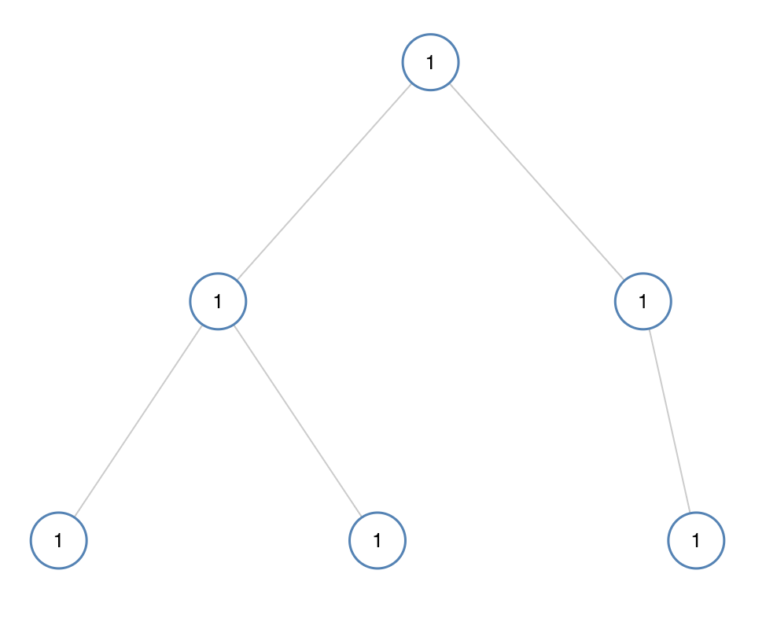
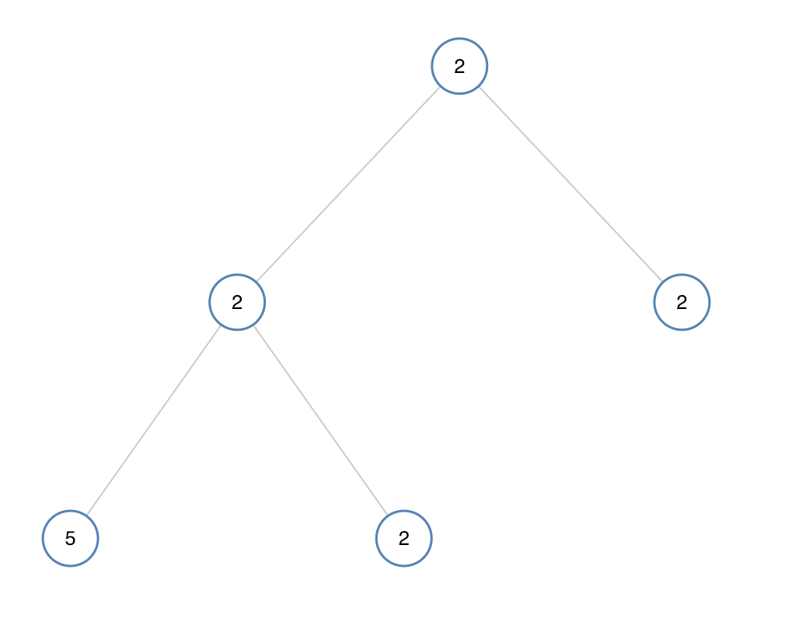

# 965. 单值二叉树 <Badge type="tip" text="Easy" />

如果二叉树每个节点都具有相同的值，那么该二叉树就是单值二叉树。

只有给定的树是单值二叉树时，才返回 `true`；否则返回 `false`。

>示例 1:  
输入：[1,1,1,1,1,null,1]. 
输出：true



>示例 2:  
输入：[2,2,2,5,2]  
输出：false



## 解题思路

输入： 一个二叉树的根节点 `root`。

输出： 判断整棵树的值是不是都是同一个值，也就是单值二叉树

本题可以用**自顶向下 DFS**解决也可以用 **自底向上 DFS**解决。

### 自底向上 DFS

**自底向上**的特点是 **先递归到叶子节点，再逐层返回、处理信息，每一层依赖其子节点的返回结果来计算当前节点的结果**。

所以我们可以思考当到最后一个子树的时候，我们只需要比较自己和左节点以及右节点是否不同

当发现和左节点不同则返回 `False`，同理比较右节点

当没有左节点或者右节点则无需比较，因为只有一个值肯定是 `True`

然后递归判断左子树和右子树是否都返回 `True`

### 自顶向下 DFS

**自顶向下** 的方案我们可以将当前节点传递给子节点去做比较，只要发现父节点和当前节点不一致则返回 `False`

然后递归判断左子树和右子树是否都返回 `True`

跟自底向上最大的区别在于是否需要传入参数，自顶向下时需要当前节点和父节点比较，自底向上是需要当前节点和子节点比较

## 代码实现

### 自底向上 DFS

::: code-group

```python
# 自底向上解法
class Solution:
    def isUnivalTree(self, root: Optional[TreeNode]) -> bool:
        def dfs(node):
            # 空节点默认是单值树
            if not node:
                return True

            # 如果左子节点存在且值不相同，返回 False
            if node.left and node.left.val != node.val:
                return False

            # 如果右子节点存在且值不相同，返回 False
            if node.right and node.right.val != node.val:
                return False

            # 递归判断左右子树是否都是单值树
            return dfs(node.left) and dfs(node.right)

        return dfs(root)
```

```javascript
/**
 * @param {TreeNode} root
 * @return {boolean}
 */
var isUnivalTree = function(root) {
    function dfs(node) {
        if (!node) return true;

        if (node.left && node.val !== node.left.val) 
            return false;

        if (node.right && node.val !== node.right.val) 
            return false;
        
        return dfs(node.left) && dfs(node.right);
    }

    return dfs(root);
};
```

### 自顶向下 DFS

::: code-group

```python
# 自顶向下解法
def isUnivalTree(self, root: Optional[TreeNode]) -> bool:
    # 如果树为空，直接返回 True，因为空树符合单值树的定义
    if not root:
        return True
    
    # 深度优先搜索，检查节点值是否与父节点值相同
    def dfs(node: Optional[TreeNode], parentVal: int) -> bool:
        # 如果节点为空，返回 True（递归终止条件）
        if not node:
            return True
        
        # 如果当前节点值与父节点值不同，返回 False
        if node.val != parentVal:
            return False
        
        # 递归检查左子树和右子树，父节点值为当前节点值
        left = dfs(node.left, node.val)
        right = dfs(node.right, node.val)
        
        # 左右子树都为 True 时返回 True，否则返回 False
        return left and right
    
    # 从根节点开始，传入根节点值作为初始父节点值
    return dfs(root, root.val)
```

```javascript
/**
 * @param {TreeNode} root
 * @return {boolean}
 */
var isUnivalTree = function(root) {
    function dfs(node, parentVal) {
        if (!node) return true;

        if (node.val !== parentVal)
            return false
        
        return dfs(node.left, node.val) && dfs(node.right, node.val);
    }

    return dfs(root, root.val);
};
```

:::

## 复杂度分析

时间复杂度：O(n)

空间复杂度：O(h)，h 为树的高度

## 链接

[965 国际版](https://leetcode.com/problems/univalued-binary-tree/description/)

[965 中文版](https://leetcode.cn/problems/univalued-binary-tree/description/)
