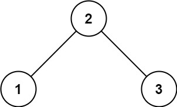

# 98. 验证二叉搜索树 <Badge type="warning" text="Medium" />

给你一个二叉树的根节点 root ，判断其是否是一个有效的二叉搜索树。

有效 二叉搜索树定义如下：

* 节点的左子树只包含 小于 当前节点的数。
* 节点的右子树只包含 大于 当前节点的数。
* 所有左子树和右子树自身必须也是二叉搜索树。

>示例 1:  
输入：root = [2,1,3]  
输出：true



>示例 2:  
输入：root = [5,1,4,null,null,3,6]  
输出：false  
解释：根节点的值是 5 ，但是右子节点的值是 4   


## 解题思路

**输入**：一个二叉树的根节点 `root`

**输出**：判断是否是二叉搜索树

本题属于**自顶向下的 DFS**问题。

## 解题思路

**输入**：一个二叉树的根节点 `root`
**输出**：判断这棵树是否是一个有效的二叉搜索树（BST）

本题属于**自顶向下的 DFS**问题。

我们可以通过递归方式向下传递每个节点的合法取值区间（左界和右界），判断当前节点值是否在合法范围内：

* 对于每个节点，要求：左子树所有节点值必须严格小于当前节点值，右子树所有节点值必须严格大于当前节点值。
* 如果节点值不在合法区间，则直接返回 False，说明不是 BST。
* 递归检查左右子树时，更新左右界限：
  * 左子树的上界为当前节点值
  * 右子树的下界为当前节点值


## 代码实现

::: code-group

```python
class Solution:
    def isValidBST(self, root: Optional[TreeNode]) -> bool:
        """
        判断一棵二叉树是否是有效的二叉搜索树（BST）
        思路：利用区间范围限制，递归判断每个节点是否符合 BST 的定义
        """
        def dfs(node, left, right):
            """
            深度优先遍历（递归）
            node: 当前节点
            left: 当前节点值的下界（必须大于）
            right: 当前节点值的上界（必须小于）
            """
            if not node:
                return True  # 空节点默认有效

            # 如果当前节点的值不在 (left, right) 区间内，则不是 BST
            if not (left < node.val < right):
                return False

            # 检查左子树，左子树的上界是当前节点的值
            isLeftValid = dfs(node.left, left, node.val)
            if not isLeftValid:
                return False

            # 检查右子树，右子树的下界是当前节点的值
            isRightValid = dfs(node.right, node.val, right)
            if not isRightValid:
                return False

            # 左右子树都合法，返回 True
            return True
        
        # 初始调用，左界为负无穷，右界为正无穷
        return dfs(root, float('-inf'), float('inf'))
```

```javascript
/**
 * @param {TreeNode} root
 * @return {boolean}
 */
var isValidBST = function(root) {
    function dfs(node, left, right) {
        if (!node) return true;

        if (node.val <= left || node.val >= right) {
            return false;
        }

        const isLeftValid = dfs(node.left, left, node.val);
        if (!isLeftValid) return false;

        const isRightValid = dfs(node.right, node.val, right);

        return isRightValid;
    }

    return dfs(root, -Infinity, Infinity);
};
```

:::

## 复杂度分析

时间复杂度：O(n)

空间复杂度：O(h)

## 链接

[98 国际版](https://leetcode.com/problems/validate-binary-search-tree/description/)

[98 中文版](https://leetcode.cn/problems/validate-binary-search-tree/description/)
