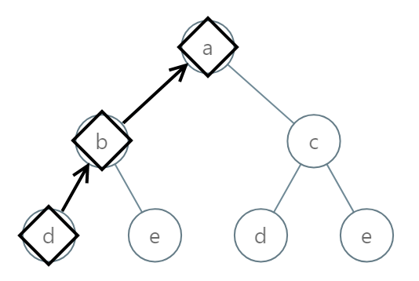
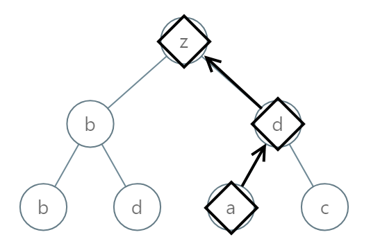
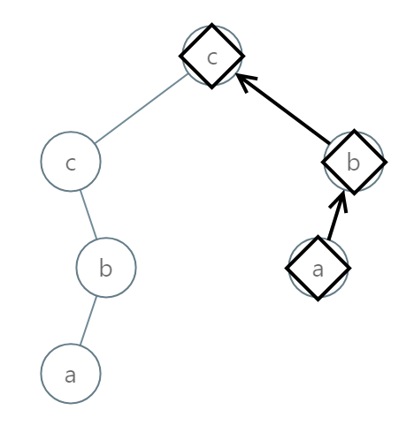

# 988. 从叶结点开始的最小字符串 <Badge type="warning" text="Medium" />

给定一颗根结点为 root 的二叉树，树中的每一个结点都有一个 [0, 25] 范围内的值，分别代表字母 'a' 到 'z'。

返回 按字典序最小 的字符串，该字符串从这棵树的一个叶结点开始，到根结点结束。

> 注：字符串中任何较短的前缀在 字典序上 都是 较小 的：  
例如，在字典序上 "ab" 比 "aba" 要小。叶结点是指没有子结点的结点。 

节点的叶节点是没有子节点的节点。

>示例 1:  
输入：root = [0,1,2,3,4,3,4]. 
输出："dba"



>示例 2:  
输入：root = [25,1,3,1,3,0,2]. 
输出："adz"



>示例 3:  
输入：root = [2,2,1,null,1,0,null,0]. 
输出："abc"



## 解题思路

输入： 一个二叉树的根节点 `root`。

输出： 从叶子结点到根节点组成一个字符串，返回按字典序最小的字符串

本题属于**自顶向下 DFS**问题。

我们可以在 dfs 遍历的时候将上一次组成的字符串传递下去，最终到达叶子结点的时候组成了完整的字符串

最终返回左右子树组成的字符串更小的那个，如果有一个子树返回空则说明没有子树，直接返回非空子树的结果

## 代码实现

::: code-group

```python
class Solution:
    def smallestFromLeaf(self, root: Optional[TreeNode]) -> str:
        def dfs(node, path):
            if not node:
                return None  # 空节点不构成字符串

            # 将当前节点的值转换为对应字符（0 -> 'a', 1 -> 'b', ..., 25 -> 'z'）
            current_char = chr(ord('a') + node.val)
            path = current_char + path  # 由于是从叶子到根，字符放在前面

            # 如果是叶子节点，直接返回当前路径字符串
            if not node.left and not node.right:
                return path

            # 递归左子树和右子树
            left = dfs(node.left, path)
            right = dfs(node.right, path)

            # 选择字典序更小的非空字符串返回
            if left and right:
                return min(left, right)
            return left or right  # 其中一个为空则返回另一个
        
        return dfs(root, "")
```

```javascript
/**
 * @param {TreeNode} root
 * @return {string}
 */
var smallestFromLeaf = function(root) {
    function dfs(node, path) {
        if (!node) return;

        const currentChar = String.fromCharCode('a'.charCodeAt(0) + node.val);
        const currentPath = currentChar + path;
        if (!node.left && !node.right) {
            return currentPath;
        }

        const left = dfs(node.left, currentPath);
        const right = dfs(node.right, currentPath);

        if (left && right)
            return left < right ? left : right;
        
        return left || right;
    }

    return dfs(root, "");
};
```

:::

## 复杂度分析

时间复杂度：O(n)

空间复杂度：O(h)，h 为树的高度

## 链接

[988 国际版](https://leetcode.com/problems/smallest-string-starting-from-leaf/description/)

[988 中文版](https://leetcode.cn/problems/smallest-string-starting-from-leaf/description/)
