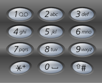

# 17. Letter Combinations of a Phone Number <Badge type="warning" text="Medium" />

Given a string containing digits from `2-9` inclusive, return all possible letter combinations that the number could represent. Return the answer in **any order**.

A mapping of digits to letters (just like on the telephone buttons) is given below. Note that 1 does not map to any letters.



> Example 1:  
Input: digits = "23"  
Output: ["ad","ae","af","bd","be","bf","cd","ce","cf"]

> Example 2:  
Input: digits = ""  
Output: []

> Example 3:  
Input: digits = "2"  
Output: ["a","b","c"]

## Approach

**Input:** Given a string containing digits from 2-9

**Output:** Return all possible letter combinations it could represent

This problem belongs to **Basic Backtracking** problems.

* Use an array `MAPPING` to map numbers to letters.
* Use backtracking (DFS) to "exhaustively generate all letter combinations for each digit".
* Process one digit per recursion, trying all its possible letters.
* Use `path` to record the currently selected path (combination).
* When reaching the last digit, add the current combination to the result list `ans`.

### Three Questions of Backtracking

1. **Current Operation?**  
    - **At the current position `i`**, try to choose a letter `c` mapped from `digits[i]` and put it into `path[i]`.
    - Meaning putting one letter from the digit `digits[i]` onto the path, representing "I've chosen this letter".

2. **Sub-problem?**  
    - **After choosing the letter `c` from `digits[i]`**, continue to recursively process all letters for the **next digit `digits[i+1]`**.
    - Meaning continue choosing at `digits[i+1]`.

3. **Next Sub-problem?**  
    - **The next recursion step** is `dfs(i+1)`, which represents continuing to construct the path at the next digit position, until the entire path is filled.

### Pruning Conditions
- Because each digit (2-9) has mapped letters, this problem doesn't need extra pruning.
- If `digits` is empty (`n==0`), just return an empty result directly.

## Implementation

::: code-group

```python
class Solution:
    def letterCombinations(self, digits: str) -> List[str]:
        # Mapping from digits to letters (2~9)
        MAPPING = ['', '', 'abc', 'def', 'ghi', 'jkl', 'mno', 'pqrs', 'tuv', 'wxyz']
        n = len(digits)

        # If input is empty, return empty list
        if not n:
            return []

        ans = []            # Store all possible results
        path = [''] * n     # Temporary path, length equals the input digits' length

        # Backtracking function: Start recursive construction from the i-th position
        def dfs(i):
            # If the whole path is filled, a complete combination is formed
            if i == n:
                ans.append(''.join(path))  # Convert path to string and add to answers
                return

            # Traverse all letters corresponding to the current digits[i]
            for c in MAPPING[int(digits[i])]:
                path[i] = c        # Choose current letter into the path
                dfs(i + 1)         # Recursively process the next digit

        dfs(0)     # Start backtracking from the 0-th position
        return ans
```

```javascript
/*
 * @param {string} digits
 * @return {string[]}
 */
const letterCombinations = function(digits) {
    // Mapping from digits to letters (corresponding to phone keypad)
    const MAPPING = ['', '', 'abc', 'def', 'ghi', 'jkl', 'mno', 'pqrs', 'tuv', 'wxyz'];

    // If the input string is empty, return an empty array directly
    if (!digits) return [];

    const ans = []; // Used to store all valid letter combinations
    const n = digits.length; // Length of the input digits
    const path = Array(digits.length).fill(0); // Temporary path array, recording current combination

    // Backtracking function, where i indicates currently processing the i-th digit
    function dfs(i) {
        // If all digits have been processed, a complete combination is constructed
        if (i == n) {
            ans.push(path.join('')); // Join path into a string and add to result array
            return;
        }

        // Traverse all letters corresponding to the current digits[i]
        for (let c of MAPPING[digits[i]]) {
            path[i] = c;    // Select current letter and place at the i-th position
            dfs(i + 1);     // Recursively process the next digit
        }
    }

    dfs(0); // Start backtracking from the 0-th digit
    return ans;
};
```

:::

## Complexity Analysis

- Time Complexity: `O(4^n * n)`
  - `4^n` is the number of all possible combinations (since each digit maps to at most 4 letters)
  - `n` is the cost of copying the string for each combination
- Space Complexity: `O(n)`

## Links

[17. Letter Combinations of a Phone Number (English)](https://leetcode.com/problems/letter-combinations-of-a-phone-number/description/)

[17. 电话号码的字母组合 (Chinese)](https://leetcode.cn/problems/letter-combinations-of-a-phone-number/description/)
