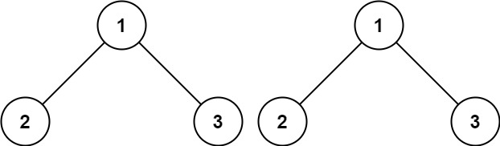
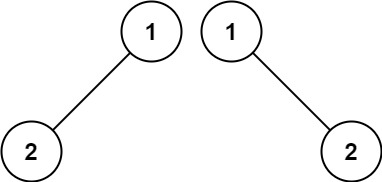
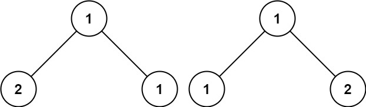

# 100. Same Tree <Badge type="tip" text="Easy" />

Given the roots of two binary trees `p` and `q`, write a function to check if they are the same or not.

Two binary trees are considered the same if they are structurally identical, and the nodes have the same value.

> Example 1:  
Input: p = [1,2,3], q = [1,2,3]  
Output: true



> Example 2:  
Input: p = [1,2], q = [1,null,2]  
Output: false



> Example 3:  
Input: p = [1,2,1], q = [1,1,2]  
Output: false



## Approach

**Input**: The root nodes of two binary trees, `p` and `q`

**Output**: Check if the two trees are the same

This problem belongs to **Bottom-up DFS** problems.

We can break the problem down into: **Recursively compare the subtrees at the same position** to see if they are equal.

Specific steps:

1. If one of the nodes is empty, only return `True` if both are empty (otherwise `False`).
2. If the values of the two current nodes are not the same, return `False` immediately.
3. Recursively compare if the left subtrees and right subtrees at corresponding positions are the same.
4. If all corresponding values and structures are the same, the two trees are the same.

## Implementation

::: code-group

```python
class Solution:
    def isSameTree(self, p: Optional[TreeNode], q: Optional[TreeNode]) -> bool:
        # If any node is empty, they are equal only if both are empty
        if p is None or q is None:
            return p is q
        
        # If current node values are not equal, directly return False
        if p.val != q.val:
            return False
        
        # Recursively compare left subtrees and right subtrees
        return self.isSameTree(p.left, q.left) and self.isSameTree(p.right, q.right)
```

```javascript
/**
 * @param {TreeNode} p
 * @param {TreeNode} q
 * @return {boolean}
 */
var isSameTree = function(p, q) {
    if (p == null || q == null) return p == q;

    if (p.val !== q.val) return false;

    return isSameTree(p.left, q.left) && isSameTree(p.right, q.right);
};
```

:::

## Complexity Analysis

- Time Complexity: `O(n)`
- Space Complexity: `O(h)`

## Links

[100. Same Tree (English)](https://leetcode.com/problems/same-tree/description/)

[100. 相同的树 (Chinese)](https://leetcode.cn/problems/same-tree/description/)
