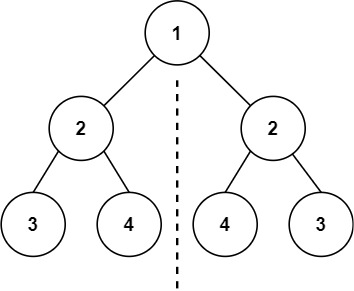
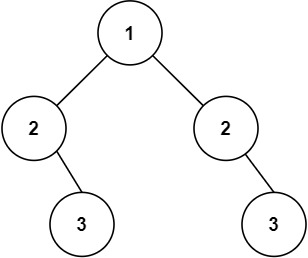

# 101. Symmetric Tree <Badge type="tip" text="Easy" />

Given the `root` of a binary tree, *check whether it is a mirror of itself* (i.e., symmetric around its center).

> Example 1:  
Input: root = [1,2,2,3,4,4,3]  
Output: true



> Example 2:  
Input: root = [1,2,2,null,3,null,3]  
Output: false



## Approach

**Input**: The root node of a binary tree, `root`

**Output**: Check if this tree is symmetric

This problem belongs to **Bottom-up DFS** problems.

Since it is just one tree, the root node is definitely the same.

We can break the problem down into: **Recursively comparing symmetrical positions in the left and right subtrees** to see if they are equal.

The coding style is consistent with Problem 100, the difference is that we need to compare **symmetrically**.

Specific steps:

1. If one of the nodes is empty, only return `True` if both are empty (otherwise `False`).
2. If the values of the two current nodes are not the same, return `False` immediately.
3. Recursively compare if the symmetric positions of the left and right subtrees are the same.
4. If all symmetric positions' values and structures are the same, the two subtrees are symmetric.

## Implementation

::: code-group

```python
class Solution:
    def isSymmetric(self, root: Optional[TreeNode]) -> bool:
        # This problem can be solved by checking if the left subtree is identical to the right subtree (mirrored)
        return self.isSameTree(root.left, root.right)
    
    # Similar to problem 100, check if the trees are the same
    def isSameTree(self, p, q):
        if not p or not q:
            return p is q

        if p.val != q.val:
            return False

        # Note the mirroring here: compare p's left with q's right, and p's right with q's left
        return self.isSameTree(p.left, q.right) and self.isSameTree(p.right, q.left)
```

```javascript
/**
 * @param {TreeNode} root
 * @return {boolean}
 */
var isSymmetric = function(root) {
    function isSameTree(p, q) {
        if (p == null || q == null) return p == q;

        if (p.val !== q.val) return false;

        return isSameTree(p.left, q.right) && isSameTree(p.right, q.left);
    }

    return isSameTree(root.left, root.right);
};
```

:::

## Complexity Analysis

- Time Complexity: `O(n)`
- Space Complexity: `O(h)`

## Links

[101. Symmetric Tree (English)](https://leetcode.com/problems/symmetric-tree/description/)

[101. 对称二叉树 (Chinese)](https://leetcode.cn/problems/symmetric-tree/description/)
