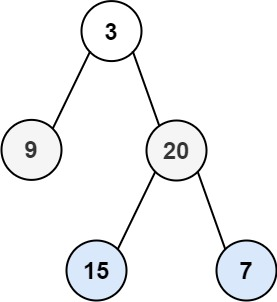

# 102. Binary Tree Level Order Traversal <Badge type="warning" text="Medium" />

Given the `root` of a binary tree, return *the level order traversal of its nodes' values*. (i.e., from left to right, level by level).



> Example 1:  
Input: root = [3,9,20,null,null,15,7]  
Output: [[3],[9,20],[15,7]]

> Example 2:  
Input: root = [1]  
Output: [[1]]

> Example 3:  
Input: root = []  
Output: []

## Approach

**Input**: The root node of a binary tree, `root`.

**Output**: Return the connected level order traversal values.

This problem belongs to **Binary Tree Traversal** problems, specifically classical Breadth-First Search (BFS), also known as Level Order Traversal.

* We use a Queue to traverse nodes level by level sequentially "from left to right, top to bottom":
* Pop out all the nodes of the current level from the queue at once
* Sequentially visit these nodes and record their values
* Add their left sub-nodes and right sub-nodes into the queue
* Repeat this process until the queue is empty

## Implementation

::: code-group

```python
class Solution:
    def levelOrder(self, root: Optional[TreeNode]) -> List[List[int]]:
        # Empty tree handling
        if not root:
            return []

        res = []  # Used to store traversal results for each level
        queue = [root]  # Use a list as BFS queue, initially put the root node

        while queue:
            level = []  # Store node values for the current level
            level_size = len(queue)  # Number of nodes in the current layer

            for _ in range(level_size):
                node = queue.pop(0)  # Pop first node (current level)
                level.append(node.val)  # Record node value

                # Add next level nodes to queue
                if node.left:
                    queue.append(node.left)
                if node.right:
                    queue.append(node.right)

            res.append(level)  # Add current layer to results list

        return res
```

```javascript
/**
 * @param {TreeNode} root
 * @return {number[][]}
 */
const levelOrder = function(root) {
    // Empty tree handling
    if (!root) return [];

    // Used to store the traversal results of each level
    const res = [];
    // Queue for BFS, initialize with root node
    const queue = [root];

    while (queue.length) {
        // Current layer node values
        const levels = [];
        // Number of nodes at current level
        const size = queue.length;

        for (let i = 0; i < size; i++) {
            // Take the head node of the queue
            const node = queue.shift();
            // Store the node's value
            levels.push(node.val);

            // Add next layer nodes to queue
            if (node.left) {
                queue.push(node.left);
            }
            // Add right child independently
            if (node.right) {
                queue.push(node.right);
            }
        }

        // Add the current level's results to the total result array
        res.push(levels);
    }

    return res;
};
```

:::

## Complexity Analysis

- Time Complexity: `O(n)`
- Space Complexity: `O(n)`

## Links

[102. Binary Tree Level Order Traversal (English)](https://leetcode.com/problems/binary-tree-level-order-traversal/description/)

[102. 二叉树的层序遍历 (Chinese)](https://leetcode.cn/problems/binary-tree-level-order-traversal/description/)
