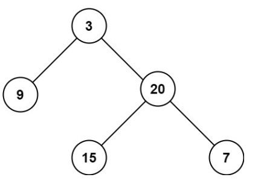

# 104. Maximum Depth of Binary Tree <Badge type="tip" text="Easy" />

Given the `root` of a binary tree, return *its maximum depth*.

A binary tree's **maximum depth** is the number of nodes along the longest path from the root node down to the farthest leaf node.



> Example 1:  
Input: root = [3,9,20,null,null,15,7]  
Output: 3

> Example 2:  
Input: root = [1,null,2]  
Output: 2

## Approach

**Input**: The root node of a binary tree, `root`.

**Output**: Return the maximum depth

This problem can be solved using **Bottom-up DFS (Postorder Traversal)** or **Top-down DFS**.

We use recursion to calculate the maximum depth of each node. The core logic is:

* For each node, its maximum depth = `max(left subtree depth, right subtree depth) + 1`
* An empty node returns depth 0 (Recursion termination condition)
* Starting from the leaf nodes, return the depth upwards layer by layer, and finally return the maximum depth of the entire tree at the root node.

This is a Postorder Traversal `(left → right → root)` process, which recursively processes the subtrees first, then aggregates the results, and finally obtains the maximum depth of the entire tree.

## Implementation

### Bottom-up DFS

::: code-group

```python
class Solution:
    def maxDepth(self, root: Optional[TreeNode]) -> int:
        # If the current node is empty, it means this is an empty tree, depth is 0
        if not root:
            return 0

        # Otherwise, recursively calculate the maximum depth of left and right subtrees, and take the larger value plus 1 (the current node itself)
        return 1 + max(self.maxDepth(root.left), self.maxDepth(root.right))
```

```javascript
const maxDepth = function(root) {
    // If the current node is empty, it means this is an empty tree, depth is 0
    if (!root) return 0;

    // Otherwise, recursively calculate the maximum depth of the left and right subtrees, and take the larger value plus 1 (the current node itself)
    return Math.max(maxDepth(root.left), maxDepth(root.right)) + 1;
};
```

:::

### Top-down DFS

::: code-group

```python
class Solution:
    def maxDepth(self, root: Optional[TreeNode]) -> int:
        def dfs(node, depth):
            if not node:
                return depth
            
            left = dfs(node.left, depth + 1)
            right = dfs(node.right, depth + 1)

            return max(left, right)
        return dfs(root, 0)
```

```javascript
const maxDepth = function(root) {
    function dfs(node, depth) {
        if (!node) return depth;

        const left = dfs(node.left, depth + 1);
        const right = dfs(node.right, depth + 1);

        return Math.max(left, right);
    }

    return dfs(root, 0);
};
```

:::

## Complexity Analysis

- Time Complexity: `O(n)`
- Space Complexity: `O(h)`

## Links

[104. Maximum Depth of Binary Tree (English)](https://leetcode.com/problems/maximum-depth-of-binary-tree/)

[104. 二叉树的最大深度 (Chinese)](https://leetcode.cn/problems/maximum-depth-of-binary-tree/)
