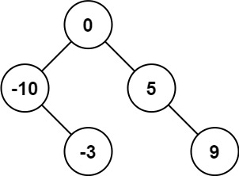
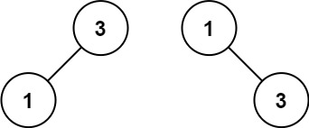

# 108. Convert Sorted Array to Binary Search Tree <Badge type="tip" text="Easy" />

Given an integer array `nums` where the elements are sorted in **ascending order**, convert *it to a **height-balanced** binary search tree*.


> Example 1:  
Input: nums = [-10,-3,0,5,9]   
Output: [0,-3,9,-10,null,5]   
Explanation: [0,-10,5,null,-3,null,9] is also accepted:



> Example 2:  
Input: nums = [1,3]   
Output: [3,1]   
Explanation: [1,null,3] and [3,1] are both height-balanced BSTs.



## Approach

**Input:** A sorted integer array `nums`

**Output:** Convert it into a balanced binary search tree

This problem belongs to **Binary Search Tree** problems.

**Properties of a Balanced Binary Search Tree:**
- The value of all nodes in the left subtree < root node value
- The value of all nodes in the right subtree > root node value
- The difference in height between left and right subtrees does not exceed 1

Since the array is sorted, taking the midpoint directly as the root node ensures that the difference in the number of elements on the left and right is `≤ 1`, making it naturally balanced.

Recursively split the interval `[l, r]`, use the midpoint as the root, and let the left and right intervals continue to recursively construct the left and right subtrees.

## Implementation

::: code-group

```python
class Solution:
    def sortedArrayToBST(self, nums: List[int]) -> Optional[TreeNode]:
        # Recursive function: Build a balanced binary search tree based on array interval [l, r]
        def build(l, r):
            # When left pointer is greater than right pointer, the interval is invalid, return empty node
            if l > r:
                return None
            
            # Take the middle position as the root node (ensures the number of nodes in left and right subtrees are as close as possible)
            mid = (l + r) // 2
            # Create the current root node
            root = TreeNode(nums[mid])
            # Recursively build the left subtree: use the left half of the array
            root.left = build(l, mid - 1)
            # Recursively build the right subtree: use the right half of the array
            root.right = build(mid + 1, r)
            # Return the current constructed subtree root node
            return root

        # Start building from the entire array interval
        return build(0, len(nums) - 1)
```

```javascript
var sortedArrayToBST = function(nums) {
    function build(l, r) {
        if (l > r) return null;
        const mid = Math.floor((l + r) / 2);
        const root = new TreeNode(nums[mid]);
        root.left = build(l, mid - 1);
        root.right = build(mid + 1, r);

        return root;
    }

    return build(0, nums.length -1);
};
```

:::

## Complexity Analysis

- Time Complexity: `O(n)`
- Space Complexity: `O(log n)` or `O(n)` depending on the depth of the recursion stack. `O(log n)` since the tree is balanced.

## Links

[108. Convert Sorted Array to Binary Search Tree (English)](https://leetcode.com/problems/convert-sorted-array-to-binary-search-tree/description/)

[108. 将有序数组转换为二叉搜索树 (Chinese)](https://leetcode.cn/problems/convert-sorted-array-to-binary-search-tree/description/)
