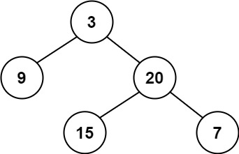
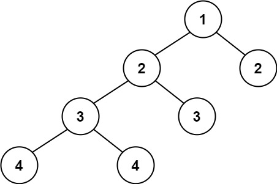

# 110. Balanced Binary Tree <Badge type="tip" text="Easy" />

Given a binary tree, determine if it is **height-balanced**.

A **height-balanced** binary tree is a binary tree in which the depth of the two subtrees of every node never differs by more than one.

> Example 1:  
Input: root = [3,9,20,null,null,15,7]  
Output: true



> Example 2:  
Input: root = [1,2,2,3,3,null,null,4,4]  
Output: false



> Example 3:  
Input: root = []  
Output: true

## Approach

**Input**: The root node of a binary tree `root`

**Output**: Determine if this tree is a balanced binary tree

This problem belongs to **Bottom-up DFS** problems.

We can break down the problem into the following steps:

* Recursively calculate the height of each subtree: `max(left_height, right_height) + 1`.
* If the height difference between the left and right subtrees of any subtree is greater than 1, it means this tree is unbalanced, return `-1` to indicate it is not balanced.
* At the beginning of the recursion, first check if the return value is `-1`. If it is, exit immediately and return `-1` to the upper-level caller.
* Only when all subtrees are balanced do we finally return their combined height, ensuring the entire tree is balanced. 

In this way, we can efficiently determine whether the entire tree is balanced. And once an imbalance is found, we can prune it early to avoid repeated calculations.

## Implementation

::: code-group

```python
class Solution:
    def isBalanced(self, root: Optional[TreeNode]) -> bool:
        """
        Determine if a binary tree is height-balanced
        Balanced binary tree: The height difference of the left and right subtrees of any node does not exceed 1
        """
        def get_height(node):
            """
            Calculate the height of the tree while checking if it is balanced
            Return value:
                - If the subtree is balanced, recursively return its height
                - If the subtree is unbalanced, return -1
            """
            if node is None:
                return 0  # Empty tree height is 0
            
            # Recursively get left subtree height
            left_height = get_height(node.left)
            # If the left subtree is already unbalanced, the whole tree is unbalanced
            if left_height == -1:
                return -1
            
            # Recursively get right subtree height
            right_height = get_height(node.right)
            # If the right subtree is unbalanced, or the height difference between left and right subtrees > 1
            if right_height == -1 or abs(left_height - right_height) > 1:
                return -1
            
            # Return the height of the current subtree
            return max(left_height, right_height) + 1
        
        # Check if the entire tree is balanced
        return get_height(root) != -1
```

```javascript
/**
 * @param {TreeNode} root
 * @return {boolean}
 */
var isBalanced = function(root) {
    function getHeight(node) {
        if (!node) return 0;

        const leftHeight = getHeight(node.left);
        if (leftHeight == -1) return -1;

        const rightHeight = getHeight(node.right);
        if (rightHeight == -1 || Math.abs(leftHeight - rightHeight) > 1) {
            return -1;
        }

        return Math.max(leftHeight, rightHeight) + 1;
    }

    return getHeight(root) !== -1;
};
```

:::

## Complexity Analysis

- Time Complexity: `O(n)`
- Space Complexity: `O(h)`

## Links

[110. Balanced Binary Tree (English)](https://leetcode.com/problems/balanced-binary-tree/description/)

[110. 平衡二叉树 (Chinese)](https://leetcode.cn/problems/balanced-binary-tree/description/)
