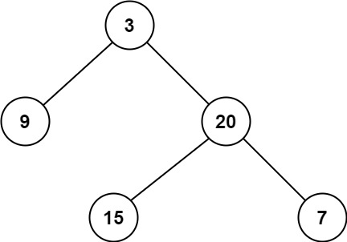

# 111. Minimum Depth of Binary Tree <Badge type="tip" text="Easy" />

Given a binary tree, find its minimum depth.

The minimum depth is the number of nodes along the shortest path from the root node down to the nearest leaf node.

**Note:** A leaf is a node with no children.



> Example 1:  
Input: root = [3,9,20,null,null,15,7]  
Output: 2

> Example 2:  
Input: root = [2,null,3,null,4,null,5,null,6]  
Output: 5

## Approach

**Input**: The root node of a binary tree `root`.

**Output**: Return the minimum depth

This problem belongs to **Breadth-First Search (BFS)** problems.

**Initialization:**  
* If `root` is empty, return 0 (an empty tree has a depth of 0)
* Initialize the queue `queue = [(root, 1)]`, which stores the node and its corresponding current depth

**BFS Traversal:**  
* Remove a node `node` and its `depth` from the queue each time
* If `node` is a leaf node (has no left or right children), immediately return the current depth `depth`
* Otherwise, push its left and right children (if they exist) to the queue, with depth incremented by one

## Implementation

::: code-group

```python
class Solution:
    def minDepth(self, root: Optional[TreeNode]) -> int:
        # If the root is empty, the tree is empty and min depth is 0
        if not root:
            return 0

        # Use BFS (Breadth First Search) queue, initialize with root and current depth 1
        queue = [(root, 1)]

        # Start traversing the binary tree level by level
        while queue:
            node, depth = queue.pop(0)  # Extract the current node and its depth

            # If the current node is a leaf (no left or right child), it's the shortest path
            if not node.left and not node.right:
                return depth  # Return current depth as min depth
            
            # If the left child exists, append to queue, depth +1
            if node.left:
                queue.append((node.left, depth + 1))
            
            # If the right child exists, append to queue, depth +1
            if node.right:
                queue.append((node.right, depth + 1))
```

```javascript
const minDepth = function(root) {
    // If the root node is empty, it means the tree is empty, and the min depth is 0
    if (!root) return 0;

    // Use a BFS queue, initialized with the root node and depth 1
    const queue = [[root, 1]];

    // Start level-by-level traversal of the binary tree
    while (queue.length) {
        // Remove the top node and its depth
        const [node, depth] = queue.shift();

        // If the current node is a leaf node (has no left/right children), we found the shortest path
        if (!node.left && !node.right)
            return depth;
        
        // If left child exists, push to queue, depth + 1
        if (node.left) 
            queue.push([node.left, depth + 1])

        // If right child exists, push to queue, depth + 1
        if (node.right) 
            queue.push([node.right, depth + 1])
    }
};
```

:::

## Complexity Analysis

- Time Complexity: `O(n)`
- Space Complexity: `O(h)` for the queue

## Links

[111. Minimum Depth of Binary Tree (English)](https://leetcode.com/problems/minimum-depth-of-binary-tree/description/)

[111. 二叉树的最小深度 (Chinese)](https://leetcode.cn/problems/minimum-depth-of-binary-tree/description/)
