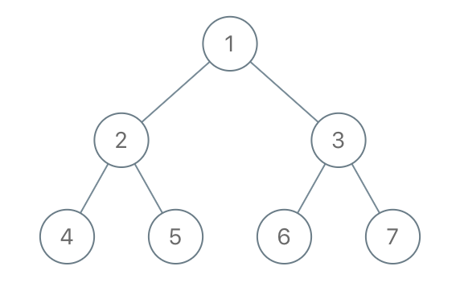

# 1110. Delete Nodes And Return Forest <Badge type="warning" text="Medium" />

Given the `root` of a binary tree, each node in the tree has a distinct value.

After deleting all nodes with a value in `to_delete`, we are left with a forest (a disjoint union of trees).

Return the roots of the trees in the remaining forest. You may return the result in any order.

> Example 1:  
Input: root = [1,2,3,4,5,6,7], to_delete = [3,5]  
Output: [[1,2,null,4],[6],[7]]



> Example 2:  
Input: root = [1,2,4,null,3], to_delete = [3]   
Output: [[1,2,4]]

## Approach

**Input**: The root node of a binary tree `root`, and a deletion list `to_delete`.

**Output**: Return a collection (forest) of trees that do not contain the deleted node values.

This problem belongs to **Bottom-up DFS + Pruning** problems.

The core of this problem is to recursively process the binary tree through **post-order traversal (Bottom-up DFS)**, delete the specified nodes, and collect the root nodes of the remaining subtrees to form a forest (collection).

### At the core
* Delete node: Remove the nodes in `to_delete` from the tree and break their connection with the parent node.
* Form a forest: After deleting a node, its non-empty left and right subtrees become the roots of new subtrees and are added to the result list.

**Key points:**

* You need to track which nodes are the root nodes of the forest (i.e. those having no parent nodes or whose parent node was deleted).
* Delete operations will change the tree structure, so be sure to process the subtrees first (postorder traversal).
* The root node requires special handling because it has no parent.

### Core Logic

**Postorder Traversal:**

* First, recursively process the left and right subtrees, and update their structure (the result after deleting the specified nodes).
* Then process the current node, decide whether to delete it, and whether to add its subtrees to the forest.

**Deletion Rules:**

* If the current node's value is in `to_delete`:
* Add its non-empty left and right subtrees to the result list (as roots of new subtrees).
* Return `None`, indicating that the current node is deleted.

**If the current node is not deleted:**

* Update its left and right subtree pointers (based on the recursion results).
* If it is a root node, or its parent was deleted, add it to the result list.

**Root Node Handling:**

* The root node has no parent, so it needs to be checked separately whether to keep it (if it's not deleted, add it to the result).

## Implementation

::: code-group

```python
class Solution:
    def delNodes(self, root: Optional[TreeNode], to_delete: List[int]) -> List[TreeNode]:
        result = []
        delete_set = set(to_delete)  # Convert to set for O(1) lookups

        def dfs(node):
            if not node:
                return None  # Empty node returns None, terminating current recursion

            # Recursively process left and right subtrees
            node.left = dfs(node.left)
            node.right = dfs(node.right)

            # Current node needs to be deleted
            if node.val in delete_set:
                # If there are child nodes, let their roots form a new tree in the result
                if node.left:
                    result.append(node.left)
                if node.right:
                    result.append(node.right)
                return None  # Return None to indicate this node is deleted

            # Current node is not deleted, return it normally
            return node

        # Special processing: if root node is not in deletion list, add to result forest
        if dfs(root):
            result.append(root)

        return result
```

```javascript
/**
 * @param {TreeNode} root
 * @param {number[]} to_delete
 * @return {TreeNode[]}
 */
var delNodes = function(root, to_delete) {
    const ans = [];
    const s = new Set(to_delete);

    function dfs(node) {
        if (!node) return null;

        node.left = dfs(node.left);
        node.right = dfs(node.right);

        if (s.has(node.val)) {
            if (node.left) ans.push(node.left);
            if (node.right) ans.push(node.right);
            return null;
        }

        return node;
    }

    if (dfs(root))
        ans.push(root);

    return ans;
};
```

:::

## Complexity Analysis

- Time Complexity: `O(n)`
- Space Complexity: `O(n)`

## Links

[1110. Delete Nodes And Return Forest (English)](https://leetcode.com/problems/delete-nodes-and-return-forest/description/)

[1110. 删点成林 (Chinese)](https://leetcode.cn/problems/delete-nodes-and-return-forest/description/)
