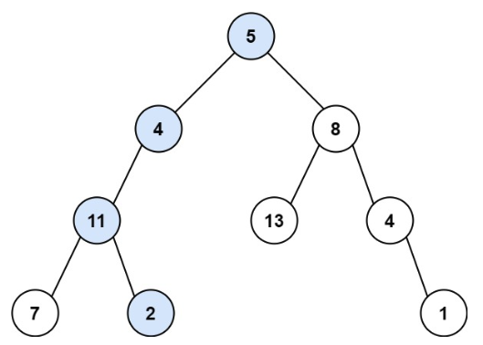

# 112. Path Sum <Badge type="tip" text="Easy" />

Given the `root` of a binary tree and an integer `targetSum`, return `true` if the tree has a **root-to-leaf** path such that adding up all the values along the path equals `targetSum`.

A **leaf** is a node with no children.



> Example 1:  
Input: root = [5,4,8,11,null,13,4,7,2,null,null,null,1], targetSum = 22  
Output: true  
Explanation: The root-to-leaf path with the target sum is shown.


> Example 2:  
Input: root = [1,2,3], targetSum = 5  
Output: false  
Explanation: There two root-to-leaf paths in the tree:  
(1 --> 2): The sum is 3.  
(1 --> 3): The sum is 4.  
There is no root-to-leaf path with sum = 5.

## Approach

**Input**: The root node of a binary tree `root`, and an integer `targetSum`, representing the target path sum.

**Output**: Determine if there is a path from the root node to a leaf node such that the sum of the node values along the path exactly equals `targetSum`.

This problem belongs to **Top-down DFS + Subtraction Accumulation** problems.

We start traversing from the root node, and during each recursion, subtract the current node's value from `targetSum`, which represents "how much of the target sum has been consumed by this path so far".

* If the current node is a leaf node, then check if the current node's value equals the remaining `targetSum`;
* Otherwise, recursively check the left and right subtrees; as long as one path satisfies the condition, return `True`.

Essentially, the key to this problem is: continuously subtracting the node values from the target sum along the path until checking if it's exactly 0 at the leaf node.

## Implementation

::: code-group

```python
class Solution:
    def hasPathSum(self, root: Optional[TreeNode], targetSum: int) -> bool:
        # If the current node is null, directly return False
        if not root:
            return False

        # If the current node is a leaf node, check if the path sum exactly equals targetSum
        if not root.left and not root.right:
            return root.val == targetSum

        # Otherwise, recursively check the left and right subtrees, update target as targetSum - current node value
        new_target = targetSum - root.val

        return (
            self.hasPathSum(root.left, new_target) or
            self.hasPathSum(root.right, new_target)
        )
```

```javascript
/**
 * @param {TreeNode} root
 * @param {number} targetSum
 * @return {boolean}
 */
var hasPathSum = function(root, targetSum) {
    // If the current node is null, directly return False
    if (!root) return false;

    // If the current node is a leaf node, check if the path sum exactly equals targetSum
    if (!root.left && !root.right) {
        return root.val == targetSum;
    }

    // Otherwise, recursively check left and right subtrees, update target as targetSum - current node value
    targetSum -= root.val;

    return hasPathSum(root.left, targetSum) || hasPathSum(root.right, targetSum)
};
```

:::

## Complexity Analysis

- Time Complexity: `O(n)`
- Space Complexity: `O(h)`

## Links

[112. Path Sum (English)](https://leetcode.com/problems/path-sum/description/)

[112. 路径总和 (Chinese)](https://leetcode.cn/problems/path-sum/description/)
