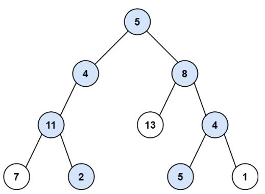
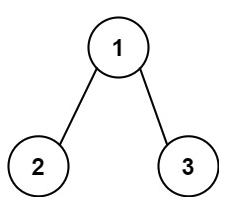

# 113. Path Sum II <Badge type="warning" text="Medium" />

Given the `root` of a binary tree and an integer `targetSum`, return *all **root-to-leaf** paths where the sum of the node values in the path equals `targetSum`*. Each path should be returned as a list of the node **values**, not node references.

A **root-to-leaf** path is a path starting from the root and ending at any leaf node. A **leaf** is a node with no children.



> Example 1:  
Input: root = [5,4,8,11,null,13,4,7,2,null,null,5,1], targetSum = 22  
Output: [[5,4,11,2],[5,8,4,5]]



> Example 2:  
Input: root = [1,2,3], targetSum = 5  
Output: []

> Example 3:  
Input: root = [1,2], targetSum = 0  
Output: []

## Approach

**Input**: The root node of a binary tree `root`, and an integer `targetSum`, representing the target path sum.

**Output**: Find all paths from the root node to leaf nodes such that the sum of the node values along the path exactly equals `targetSum`.

This problem belongs to **Top-down DFS + Path Tracking + Backtracking** problems.

We traverse all paths from root to leaves using Depth-First Search (DFS), and during the traversal:

* Each time we add the current node's value to the path `path`;
* And subtract it from `targetSum`, indicating "consumed target value";
* If it is currently a leaf node and the remaining target value is exactly equal to the node's value, it means we found a valid path, record a copy of the path;
* Every time we return from a recursion, we must remove the current node from the path `path.pop()`, performing backtracking, to explore other paths.

## Implementation

::: code-group

```python
class Solution:
    def pathSum(self, root: Optional[TreeNode], targetSum: int) -> List[List[int]]:
        res = []  # Used to store all paths that meet the conditions

        def dfs(node: Optional[TreeNode], remaining: int, path: List[int]):
            if not node:
                return  # Reached an empty node, return

            # Add the current node to the path
            path.append(node.val)

            # If it's a leaf node and the path sum exactly equals the target value
            if not node.left and not node.right:
                if node.val == remaining:
                    # Note to add a copy of path, otherwise subsequent modifications will affect the result
                    res.append(list(path))

            # Continue searching left and right subtrees, subtracting the current node's value from the target value
            dfs(node.left, remaining - node.val, path)
            dfs(node.right, remaining - node.val, path)

            # Backtrack: undo the modification to the path by this level's recursion
            path.pop()

        # Start DFS from the root node, initially with an empty path
        dfs(root, targetSum, [])

        return res
```

```javascript
/**
 * @param {TreeNode} root
 * @param {number} targetSum
 * @return {number[][]}
 */
var pathSum = function(root, targetSum) {
    // Used to store all paths that meet the condition
    const res = [];

    function dfs(node, targetSum, path) {
        // Reached an empty node, return
        if (!node) return;

        // Add the current node to the path
        path.push(node.val)

        // If leaf node and path sum exactly equals targetSum
        if (!node.left && !node.right && targetSum == node.val)
            // Note we must add a copy of the path, otherwise subsequent modifications affect the result
            res.push([...path]);
        
        // Continue searching left and right subtrees, target value minus the current node's value
        dfs(node.left, targetSum - node.val, path)
        dfs(node.right, targetSum - node.val, path)

        path.pop()
    }

    // Start DFS from the root node, initially with an empty path
    dfs(root, targetSum, [])
    
    return res;
};
```

:::

## Complexity Analysis

- Time Complexity: `O(n)`
- Space Complexity: `O(n)`

## Links

[113. Path Sum II (English)](https://leetcode.com/problems/path-sum-ii/description/)

[113. 路径总和 II (Chinese)](https://leetcode.cn/problems/path-sum-ii/description/)
