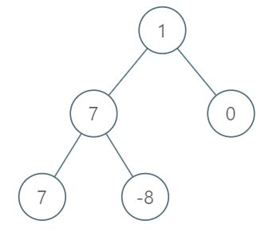

# 1161. Maximum Level Sum of a Binary Tree <Badge type="warning" text="Medium" />

Given the `root` of a binary tree, the level of its root is `1`, the level of its children is `2`, and so on.

Return the **smallest** level `x` such that the sum of all the values of nodes at level `x` is **maximal**.



> Example 1:  
Input: root = [1,7,0,7,-8,null,null]   
Output: 2   
Explanation:  
Level 1 sum = 1.  
Level 2 sum = 7 + 0 = 7.  
Level 3 sum = 7 + -8 = -1.  
So we return the level with the maximum sum which is level 2.

> Example 2:  
Input: root = [989,null,10250,98693,-89388,null,null,null,-32127]   
Output: 2

## Approach

**Input:** The root node of a binary tree `root`

**Output:** Return the level number with the maximum sum of node elements. If there are multiple maximums, return the smallest level number.

This problem belongs to **BFS Traversal** problems.

- Use a queue to do level-order traversal;
- Let `level` record the current level number, starting from 1;
- Sum up all nodes in the current level, compare it with the historical maximum, and update the answer level number;
- Return the minimum level number corresponding to the maximum sum (naturally satisfied because we traverse from top to bottom).

## Implementation

::: code-group

```python
class Solution:
    def maxLevelSum(self, root: Optional[TreeNode]) -> int:
        queue = [root]  # Initialize the queue with the root node
        max_level = 1  # Record the level with the max node sum, initially level 1
        max_sum = float('-inf')  # Record the current max level sum, initially negative infinity
        level = 1  # Current level number, initially 1

        while queue:
            level_sum = 0  # Sum of node values in the current level
            next_level = []  # Store the nodes for the next level

            # Traverse all nodes in the current level
            for node in queue:
                level_sum += node.val  # Add to the sum of the current level

                # If there's a left child, add it to the next level queue
                if node.left:
                    next_level.append(node.left)
                # If there's a right child, add it to the next level queue
                if node.right:
                    next_level.append(node.right)

            # If the current level's sum is greater than the max sum so far, update max sum and level
            if level_sum > max_sum:
                max_sum = level_sum
                max_level = level

            # Update the queue for the next level and increment level number
            queue = next_level
            level += 1

        return max_level  # Return the level with the max node sum
```

```javascript
/**
 * @param {TreeNode} root
 * @return {number}
 */
var maxLevelSum = function(root) {
    let queue = [root];
    let level = 1;
    let maxLevel = 1
    let maxSum = -Infinity;

    while (queue.length) {
        let levelSum = 0;
        const nextLevel = [];

        const size = queue.length;
        for (let i = 0; i < size; i++) {
            const node = queue[i];

            levelSum += node.val;

            if (node.left) nextLevel.push(node.left);
            if (node.right) nextLevel.push(node.right);
        }

        if (levelSum > maxSum) {
            maxSum = levelSum;
            maxLevel = level;
        }

        level++;
        queue = nextLevel;
    }

    return maxLevel;
};
```

:::

## Complexity Analysis

- Time Complexity: `O(n)`
- Space Complexity: `O(w)` where `w` is the max width of the BFS queue.

## Links

[1161. Maximum Level Sum of a Binary Tree (English)](https://leetcode.com/problems/maximum-level-sum-of-a-binary-tree/description/)

[1161. 最大层内元素和 (Chinese)](https://leetcode.cn/problems/maximum-level-sum-of-a-binary-tree/description/)
