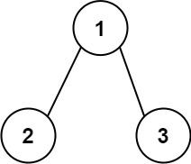
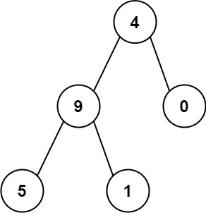

# 129. Sum Root to Leaf Numbers <Badge type="warning" text="Medium" />

You are given the `root` of a binary tree containing digits from `0` to `9` only.

Each root-to-leaf path in the tree represents a number.

- For example, the root-to-leaf path `1 -> 2 -> 3` represents the number `123`.

Return *the total sum of all root-to-leaf numbers*. Test cases are generated so that the answer will fit in a **32-bit** integer.

A **leaf** node is a node with no children.

> Example 1:  
Input: root = [1,2,3]  
Output: 25  
Explanation:  
The root-to-leaf path 1->2 represents the number 12.  
The root-to-leaf path 1->3 represents the number 13.  
Therefore, sum = 12 + 13 = 25.



> Example 2:  
Input: root = [4,9,0,5,1]  
Output: 1026  
Explanation:  
The root-to-leaf path 4->9->5 represents the number 495.  
The root-to-leaf path 4->9->1 represents the number 491.  
The root-to-leaf path 4->0 represents the number 40.  
Therefore, sum = 495 + 491 + 40 = 1026.



## Approach

**Input:** The root node of a binary tree `root`.

**Output:** Calculate the total sum of all numbers generated from the root node to the leaf nodes.

This problem belongs to **Top-down DFS + Path Tracking** problems.

* We can define a recursive depth-first traversal function `dfs`.
* During the traversal, check if it's a leaf node.
* If it is, return the sum `num * 10 + node.val`.
* If not, continue to recursively traverse the left and right subtrees and pass down the currently tracked path number.

The key point is in calculating the path number from the root to the leaf node: `dfs(node.left, num * 10 + node.val)`.

## Implementation

::: code-group

```python
class Solution:
    def sumNumbers(self, root: Optional[TreeNode]) -> int:
        # Define the DFS function, parameter node is the current node, num is the number formed from the root to the current node's path
        def dfs(node, num):
            # If the current node is null, return 0 (no complete number is formed)
            if not node:
                return 0
            
            # If the current node is a leaf node, return the number formed from root to this leaf
            if not node.left and not node.right:
                return num * 10 + node.val
            
            # Recursively calculate the path sum for the left and right subtrees
            left_sum = dfs(node.left, num * 10 + node.val)
            right_sum = dfs(node.right, num * 10 + node.val)
            
            # Return the sum of path sums of both left and right subtrees
            return left_sum + right_sum
        
        # Start DFS from the root, initial path value is 0
        return dfs(root, 0)
```

```javascript
/**
 * @param {TreeNode} root
 * @return {number}
 */
var sumNumbers = function(root) {
    function dfs(node, num) {
        if (!node) return 0;

        if (!node.left && !node.right) {
            return num * 10 + node.val;
        }

        const leftSum = dfs(node.left, num * 10 + node.val);
        const rightSum = dfs(node.right, num * 10 + node.val);

        return leftSum + rightSum;
    }

    return dfs(root, 0);
};
```

:::

## Complexity Analysis

- Time Complexity: `O(n)`
- Space Complexity: `O(h)`, where `h` is the height of the tree

## Links

[129. Sum Root to Leaf Numbers (English)](https://leetcode.com/problems/sum-root-to-leaf-numbers/description/)

[129. 求根节点到叶节点数字之和 (Chinese)](https://leetcode.cn/problems/sum-root-to-leaf-numbers/description/)
