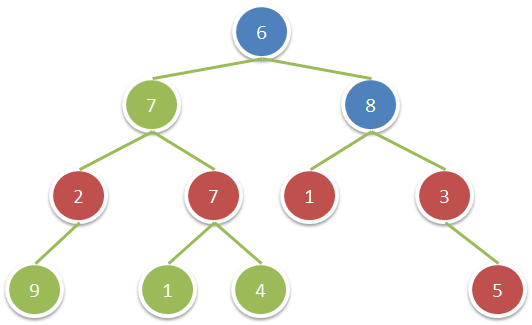

# 1315. Sum of Nodes with Even-Valued Grandparent <Badge type="warning" text="Medium" />

Given the `root` of a binary tree, return *the sum of values of nodes with an **even-valued grandparent***. If there are no nodes with an **even-valued grandparent**, return `0`.

A **grandparent** of a node is the parent of its parent if it exists.

> Example 1:  
Input: root = [6,7,8,2,7,1,3,9,null,1,4,null,null,null,5]. 
Output: 18. 
Explanation: The red nodes are the nodes with even-value grandparent while the blue nodes are the even-value grandparents.



## Approach

**Input:** The root node of a binary tree `root`.

**Output:** Return the sum of all nodes assuming their grandparent node is even.

This problem belongs to **Top-down DFS** problems.

We need to first find the nodes that have a grandparent node, and the grandparent node is an even number, then sum them up and return.

We can pass the **parent node** and the **grandparent node** together as parameters during traversal, updating the parent and grandparent node in each level passed down.

When we find that the grandparent node is an even number, we record the current node's value, and then continue to recursively traverse down to the current node's child nodes.

If the grandparent node is not an even number, we mark the current node's value as 0 because there is no need to record it, and then continue recursion.

Finally, return `the recorded value of the current node + the recorded value of the left subtree + the recorded value of the right subtree` as the answer.

## Implementation

::: code-group

```python
class Solution:
    def sumEvenGrandparent(self, root: Optional[TreeNode]) -> int:
        def dfs(node, parent, grandparent):
            if not node:
                return 0

            # If the grandparent node exists and its value is even, add the current node's value
            val = node.val if grandparent and grandparent % 2 == 0 else 0

            # Recursively process the left and right subtrees while updating the parent and grandparent nodes
            left = dfs(node.left, node.val, parent)
            right = dfs(node.right, node.val, parent)

            return val + left + right

        # Initially both parent and grandparent nodes don't exist
        return dfs(root, None, None)
```

```javascript
/**
 * @param {TreeNode} root
 * @return {number}
 */
var sumEvenGrandparent = function(root) {
    function dfs(node, p, gp) {
        if (!node) return 0;

        const val = gp && gp % 2 == 0 ? node.val : 0;

        const left = dfs(node.left, node.val, p);
        const right = dfs(node.right, node.val, p);

        return val + left + right;
    }

    return dfs(root, null, null);
};
```

:::

## Complexity Analysis

- Time Complexity: `O(n)`
- Space Complexity: `O(h)`, where `h` is the height of the tree.

## Links

[1315. Sum of Nodes with Even-Valued Grandparent (English)](https://leetcode.com/problems/sum-of-nodes-with-even-valued-grandparent/description/)

[1315. 祖父节点值为偶数的节点和 (Chinese)](https://leetcode.cn/problems/sum-of-nodes-with-even-valued-grandparent/description/)
