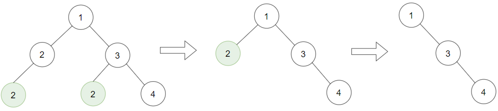

# 1325. Delete Leaves With a Given Value <Badge type="warning" text="Medium" />

Given a binary tree `root` and an integer `target`, delete all the **leaf nodes** with value `target`.

Note that once you delete a leaf node with value `target`, if its parent node becomes a leaf node and has the value `target`, it should also be deleted (you need to continue doing that until you cannot).

> Example 1:  
Input: root = [1,2,3,2,null,2,4], target = 2 
Output: [1,null,3,null,4]  
Explanation: Leaf nodes in green with value (target = 2) are removed (Picture in left). 
After removing, new nodes become leaf nodes with value (target = 2) (Picture in center).



> Example 2:  
Input: root = [1,3,3,3,2], target = 3   
Output: [1,3,null,null,2]


> Example 3:  
Input: root = [1,2,null,2,null,2], target = 2  
Output: [1]  
Explanation: Leaf nodes in green with value (target = 2) are removed at each step.


## Approach

**Input**: The root node of a binary tree `root`.

**Output**: Return the original binary tree with all leaf nodes containing `target` removed.

This problem belongs to **Bottom-up DFS + Pruning** problems.

This problem is the same pruning approach as problem 814.

For each node:
* Recursively process the left subtree, deleting leaf nodes with value `target`.
* Recursively process the right subtree, deleting leaf nodes with value `target`.
* Check whether the current node is a leaf node (both left and right child nodes are `None`) and its value equals `target`:
* If it is, return `None` (delete the current node).
* Otherwise, return the current node (keep).

Because the recursion execution order is upward, we will start judging from the child nodes and finally return to the parent node to judge, so as to achieve the order of processing from the leaf nodes to the root node.

## Implementation

::: code-group

```python
class Solution:
    def removeLeafNodes(self, root: Optional[TreeNode], target: int) -> Optional[TreeNode]:
        def dfs(node):
            if not node:
                return None  # Return directly for empty nodes

            # Recursively process left and right subtrees
            node.left = dfs(node.left)
            node.right = dfs(node.right)

            # If the current node is a leaf node and its value equals target, delete it (return None)
            if not node.left and not node.right and node.val == target:
                return None

            # Otherwise keep the current node
            return node

        return dfs(root)
```

```javascript
/**
 * @param {TreeNode} root
 * @param {number} target
 * @return {TreeNode}
 */
var removeLeafNodes = function(root, target) {
    function dfs(node) {
        if (!node) return null;

        node.left = dfs(node.left);
        node.right = dfs(node.right);

        if (node.val == target && !node.left && !node.right)
            return null;

        return node;
    }  

    return dfs(root);
};
```

:::

## Complexity Analysis

- Time Complexity: `O(n)`
- Space Complexity: `O(h)`, where `h` is the height of the tree

## Links

[1325. Delete Leaves With a Given Value (English)](https://leetcode.com/problems/delete-leaves-with-a-given-value/description/)

[1325. 删除给定值的叶子节点 (Chinese)](https://leetcode.cn/problems/delete-leaves-with-a-given-value/description/)
