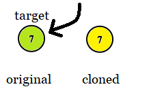
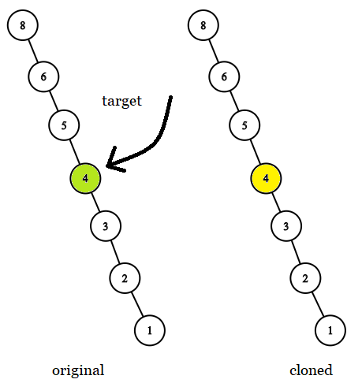

# 1379. Find a Corresponding Node of a Binary Tree in a Clone of That Tree <Badge type="tip" text="Easy" />

Given two binary trees `original` and `cloned` and given a reference to a node `target` in the original tree.

The `cloned` tree is a **copy of** the `original` tree.

Return *a reference to the same node* in the `cloned` tree.

**Note** that you are **not allowed** to change any of the two trees or the `target` node and the answer **must be** a reference to a node in the `cloned` tree.

> Example 1:  
Input: tree = [7,4,3,null,null,6,19], target = 3  
Output: 3  
Explanation: In all examples the original and cloned trees are shown. The target node is a green node from the original tree. The answer is the yellow node from the cloned tree.


> Example 2:  
Input: tree = [7], target =  7  
Output: 7



> Example 3:  
Input: tree = [8,null,6,null,5,null,4,null,3,null,2,null,1], target = 4  
Output: 4



## Approach

**Input:** A binary tree `original` and a clone `cloned`.

**Output:** Return the target node in the clone tree that is identical to the one in the original binary tree.

This problem belongs to **Bottom-up DFS** problems.

We only need to recursively traverse the nodes of the original binary tree in the same order. When `target` is found, directly return the current node of the clone tree which is the answer.

## Implementation

::: code-group

```python
class Solution:
    def getTargetCopy(self, original: TreeNode, cloned: TreeNode, target: TreeNode) -> TreeNode:
        def dfs(o, c):
            # If the original tree node is empty, return None (termination condition)
            if not o:
                return None

            # Found the target node, return the corresponding node in the cloned tree
            if o == target:
                return c

            # Search recursively in the left subtree
            left = dfs(o.left, c.left)
            if left:
                return left  # If found in the left subtree, return directly

            # Otherwise, search in the right subtree
            return dfs(o.right, c.right)

        return dfs(original, cloned)
```

```javascript
/**
 * @param {TreeNode} original
 * @param {TreeNode} cloned
 * @param {TreeNode} target
 * @return {TreeNode}
 */

var getTargetCopy = function(original, cloned, target) {
    function dfs(c, o) {
        if (!c) return null;

        if (c == target) return o;

        return dfs(c.left, o.left) || dfs(c.right, o.right);
    }

    return dfs(original, cloned);
};
```

:::

## Complexity Analysis

- Time Complexity: `O(n)`
- Space Complexity: `O(h)`, where `h` is the height of the tree

## Links

[1379. Find a Corresponding Node of a Binary Tree in a Clone of That Tree (English)](https://leetcode.com/problems/find-a-corresponding-node-of-a-binary-tree-in-a-clone-of-that-tree/description/)

[1379. 找出克隆二叉树中的相同节点 (Chinese)](https://leetcode.cn/problems/find-a-corresponding-node-of-a-binary-tree-in-a-clone-of-that-tree/description/)
