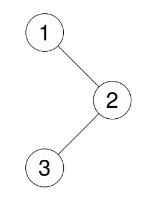
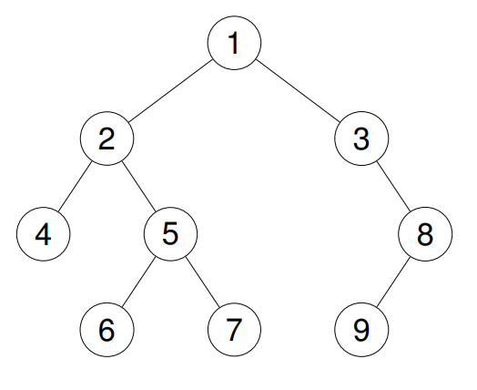

# 144. Binary Tree Preorder Traversal <Badge type="tip" text="Easy" />

Given the `root` of a binary tree, return *the preorder traversal of its nodes' values*.



> Example 1:  
Input: root = [1,null,2,3]  
Output: [1,2,3]



> Example 2:  
Input: root = [1,2,3,4,5,null,8,null,null,6,7,9]  
Output: [1,2,4,5,6,7,3,8,9]

> Example 3:  
Input: root = []  
Output: []

## Approach

**Input:** The root node of a binary tree `root`.

**Output:** Return the preorder traversal of its nodes' values.

This problem belongs to **Binary Tree Traversal** problems.

The access order of preorder traversal is: Root Node → Left Subtree → Right Subtree.

We can achieve preorder traversal by defining a recursive depth-first traversal function `dfs`, immediately recording its value each time we recursively enter a node.

## Implementation

::: code-group

```python
class Solution:
    def preorderTraversal(self, root: Optional[TreeNode]) -> List[int]:
        # Used to store the traversal results
        res = []

        # Define a recursive function to perform preorder traversal: Root -> Left -> Right
        def dfs(node: Optional[TreeNode]):
            if node is None:
                return

            res.append(node.val)     # Record the current node
            dfs(node.left)           # Recursively traverse the left subtree
            dfs(node.right)          # Recursively traverse the right subtree

        # Start traversal from the root node
        dfs(root)

        return res
```

```javascript
/**
 * @param {TreeNode} root
 * @return {number[]}
 */
const preorderTraversal = function(root) {
    // Used to store the traversal results
    const res = [];

    // Define a recursive function to perform preorder traversal: Root -> Left -> Right
    function dfs(node) {
        if (!node) return;

        // Record the current node
        res.push(node.val);
        // Recursively traverse the left subtree
        dfs(node.left);
        // Recursively traverse the right subtree
        dfs(node.right);
    }

    dfs(root);
    return res;
};
```

:::

## Complexity Analysis

- Time Complexity: `O(n)`
- Space Complexity: `O(h)`, where `h` is the height of the tree

## Links

[144. Binary Tree Preorder Traversal (English)](https://leetcode.com/problems/binary-tree-preorder-traversal/description/)

[144. 二叉树的前序遍历 (Chinese)](https://leetcode.cn/problems/binary-tree-preorder-traversal/description/)
