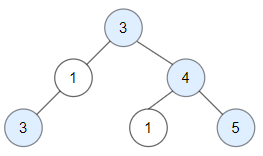
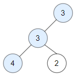

# 1448. Count Good Nodes in Binary Tree <Badge type="warning" text="Medium" />

Given a binary tree `root`, a node *X* in the tree is named **good** if in the path from root to *X* there are no nodes with a value *greater than* X.

Return the number of **good** nodes in the binary tree.

> Example 1:  
Input: root = [3,3,null,4,2]  
Output: 3  
Explanation: Node 2 -> (3, 3, 2) is not good, because "3" is higher than it.



> Example 2:  
Input: root = [1]  
Output: 1  
Explanation: Root is considered as good.



## Approach

**Input:** The root node of a binary tree `root`.

**Output:** Return the number of "good nodes" in this tree.

This problem belongs to **Top-down DFS** problems.

We can pass down the previous maximum value `max_val` while traversing.

When `node.val >= max_val`, the good node count is `good = 1`, otherwise `good = 0`.

Continue traversing the left and right subtrees, and finally return `good + left_good + right_good` to get the answer.

## Implementation

::: code-group

```python
class Solution:
    def goodNodes(self, root: TreeNode) -> int:
        """
        Count the number of good nodes in a binary tree
        Definition of a good node: On the path from the root to this node, there is no node with a value greater than its value
        """
        def dfs(node, max_val):
            if not node:
                return 0  # Return 0 directly for an empty node
            
            # Is the current node a good node?
            good = 1 if node.val >= max_val else 0
            # Update the maximum value on the path
            max_val = max(max_val, node.val)
            
            # Calculate the number of good nodes in the left and right subtrees separately
            left_good = dfs(node.left, max_val)
            right_good = dfs(node.right, max_val)
            
            # Return sum
            return good + left_good + right_good

        return dfs(root, root.val)
```

```javascript
/**
 * @param {TreeNode} root
 * @return {number}
 */
var goodNodes = function(root) {
    function dfs(node, maxVal) {
        if (!node) return 0;

        const good = node.val >= maxVal ? 1 : 0;
        const newMaxVal = Math.max(maxVal, node.val);

        const leftGood = dfs(node.left, newMaxVal);
        const rightGood = dfs(node.right, newMaxVal);

        return good + leftGood + rightGood;
    }

    return dfs(root, root.val);
};
```

:::

## Complexity Analysis

- Time Complexity: `O(n)`
- Space Complexity: `O(h)`, where `h` is the height of the tree

## Links

[1448. Count Good Nodes in Binary Tree (English)](https://leetcode.com/problems/count-good-nodes-in-binary-tree/description/)

[1448. 统计二叉树中好节点的数目 (Chinese)](https://leetcode.cn/problems/count-good-nodes-in-binary-tree/description/)
