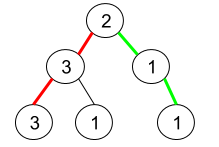

# 1457. Pseudo-Palindromic Paths in a Binary Tree <Badge type="warning" text="Medium" />

Given a binary tree where node values are digits from 1 to 9. A path in the binary tree is said to be **pseudo-palindromic** if at least one permutation of the node values in the path is a palindrome.

Return *the number of **pseudo-palindromic** paths going from the root node to leaf nodes*.

> Example 1:  
Input: root = [2,3,1,3,1,null,1]  
Output: 2   
Explanation: The figure above represents the given binary tree. There are three paths going from the root node to leaf nodes: the red path [2,3,3], the green path [2,1,1], and the path [2,3,1]. Among these paths only red path and green path are pseudo-palindromic paths since the red path [2,3,3] can be rearranged in [3,2,3] (palindrome) and the green path [2,1,1] can be rearranged in [1,2,1] (palindrome).



> Example 2:  
Input: root = [2,1,1,1,3,null,null,null,null,null,1]   
Output: 1   
Explanation: The figure above represents the given binary tree. There are three paths going from the root node to leaf nodes: the green path [2,1,1], the path [2,1,3,1], and the path [2,1]. Among these paths only the green path is pseudo-palindromic since [2,1,1] can be rearranged in [1,2,1] (palindrome).


> Example 3:  
Input: root = [9]  
Output: 1

## Approach

**Input:** The root node of a binary tree `root`, where values are from 1 to 9.

**Output:** Return the number of "pseudo-palindromic" paths in this tree.

This problem belongs to **Top-down DFS** problems.

The key to this problem is to determine the "pseudo-palindrome". To satisfy a palindromic path, we need to ensure that the collection of values has at most one odd count.

We can traverse the binary tree `top-down` to record the paths, which can be done with an array or a `set`.

Here we can use a `set` to determine if the current value has already appeared once. If it has appeared, we remove it, if it's not in the `set`, we add it in.

When visiting a leaf node, evaluate `len(set) <= 1`. If the condition is met, it's a pseudo-palindromic path, and we return 1, otherwise return 0.

## Implementation

::: code-group

```python
class Solution:
    def pseudoPalindromicPaths(self, root: Optional[TreeNode]) -> int:
        def dfs(node, odd_set):
            if not node:
                return 0
            
            # If the current node value is already in the set, it means it has appeared once (now an even number of times), remove it
            # Otherwise, add it to the set, representing an odd number of times
            if node.val in odd_set:
                odd_set.remove(node.val)
            else:
                odd_set.add(node.val)
            
            # If it's a leaf node
            if not node.left and not node.right:
                # Pseudo-palindrome condition: at most one number appeared an odd number of times
                return 1 if len(odd_set) <= 1 else 0
            
            # Note: to prevent left and right from sharing the same set, we must create a copy
            left_count = dfs(node.left, set(odd_set))
            right_count = dfs(node.right, set(odd_set))
            
            return left_count + right_count
        
        # Initially pass an empty set, representing no numbers on the current path
        return dfs(root, set())
```

```javascript
/**
 * @param {TreeNode} root
 * @return {number}
 */
var pseudoPalindromicPaths  = function(root) {
    function dfs(node, oddSet) {
        if (!node) return 0;

        if (oddSet.has(node.val)) {
            oddSet.delete(node.val);
        } else {
            oddSet.add(node.val);
        }

        if (!node.left && !node.right) {
            return oddSet.size <= 1 ? 1 : 0;
        }

        const left = dfs(node.left, new Set(oddSet));
        const right = dfs(node.right, new Set(oddSet));

        return left + right;
    }

    return dfs(root, new Set());
};
```

:::

## Complexity Analysis

- Time Complexity: `O(n)`
- Space Complexity: `O(h)`, where `h` is the height of the tree. `O(9 * h)` because each set has at most 9 elements.

## Links

[1457. Pseudo-Palindromic Paths in a Binary Tree (English)](https://leetcode.com/problems/pseudo-palindromic-paths-in-a-binary-tree/description/)

[1457. 二叉树中的伪回文路径 (Chinese)](https://leetcode.cn/problems/pseudo-palindromic-paths-in-a-binary-tree/description/)
