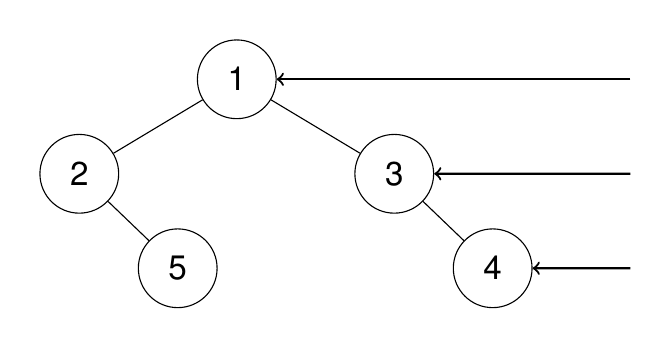

# 199. Binary Tree Right Side View <Badge type="warning" text="Medium" />

Given the `root` of a binary tree, imagine yourself standing on the **right side** of it, return *the values of the nodes you can see ordered from top to bottom*.

> Example 1:  
Input: root = [1,2,3,null,5,null,4]  
Output: [1,3,4]



> Example 2:  
Input: root = [1,2,3,4,null,null,null,5]  
Output: [1,3,4,5]


> Example 3:  
Input: root = [1,null,3]  
Output: [1,3]

> Example 4:  
Input: root = []  
Output: []

## Approach

**Input**: The root node of a binary tree `root`

**Output**: Return the right side view of this tree (the rightmost node of each level)

This problem belongs to **Top-down DFS** problems.

To get the right side view of a tree, you can use the order of traversing the right subtree first. We use a list to store the first node reached at each level (the rightmost node). During traversal:

* If the current depth equals the length of the result list, it means this is the first node accessed at this level (i.e. the rightmost node), add it to the result.
* Recursively traverse the right subtree first, then recursively traverse the left subtree, this ensures that the nodes on the right side are recorded first.

This ensures that the first node accessed at each level is exactly the node seen in the right view.

## Implementation

::: code-group

```python
class Solution:
    def rightSideView(self, root: Optional[TreeNode]) -> List[int]:
        """
        Return the right side view of the binary tree
        Idea: DFS, traverse right subtree first, record only the first accessed node of each level
        """
        ans = []  # Store the rightmost node of each level

        def dfs(node, depth):
            """
            Depth-first traversal of the binary tree
            node: current node
            depth: current depth (starts from 0)
            """
            if not node:
                return  # Return directly for empty nodes

            # If the current depth equals the length of the result list, it means this is the first accessed node (rightmost) at this level
            if depth == len(ans):
                ans.append(node.val)

            # Traverse the right subtree first, then traverse the left subtree
            dfs(node.right, depth + 1)
            dfs(node.left, depth + 1)
        
        dfs(root, 0)
        return ans
```

```javascript
/**
 * @param {TreeNode} root
 * @return {number[]}
 */
var rightSideView = function(root) {
    const ans = [];

    function dfs(node, depth) {
        if (!node) return;

        if (depth == ans.length) {
            ans.push(node.val);
        }

        dfs(node.right, depth + 1);
        dfs(node.left, depth + 1);
    }

    dfs(root, 0);
    return ans;
};
```

:::

## Complexity Analysis

- Time Complexity: `O(n)`
- Space Complexity: `O(h)`

## Links

[199. Binary Tree Right Side View (English)](https://leetcode.com/problems/binary-tree-right-side-view/description/)

[199. 二叉树的右视图 (Chinese)](https://leetcode.cn/problems/binary-tree-right-side-view/description/)
