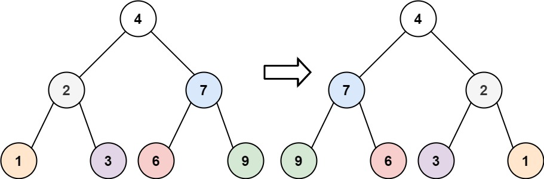
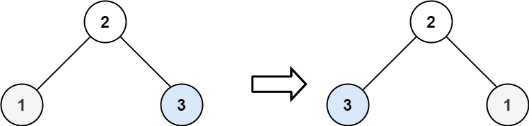

# 226. Invert Binary Tree <Badge type="tip" text="Easy" />

Given the `root` of a binary tree, invert the tree, and return its root.

> Example 1:  
Input: root = [4,2,7,1,3,6,9]   
Output: [4,7,2,9,6,3,1]



> Example 2:  
Input: root = [2,1,3]   
Output: [2,3,1]



> Example 3:  
Input: root = []   
Output: []

## Approach

**Input:** The root node of a binary tree `root`.

**Output:** Invert this binary tree and return the root node.

This problem belongs to **Invert Binary Tree** problems.

We can use `dfs` to recursively process each node of the binary tree.

Execute the left and right subtrees swapping for the current node, then recursively process the left and right child nodes.

The root node does not change, but the internal structure has been modified, so just returning root is fine.

## Implementation

::: code-group

```python
class Solution:
    def invertTree(self, root: Optional[TreeNode]) -> Optional[TreeNode]:        
        def dfs(node):
            # 🛑 Recursion termination condition: if node is empty, return directly
            if not node:
                return
            
            # 🔁 Swap the left and right child nodes of the current node
            node.left, node.right = node.right, node.left

            # ⬇️ Recursively invert the left and right subtrees
            dfs(node.left)
            dfs(node.right)
        
        # 🚀 Start recursively inverting the whole tree from the root node
        dfs(root)

        # ✅ Return the root node after inversion
        return root
```

```javascript
/*
 * @param {TreeNode} root
 * @return {TreeNode}
 */
var invertTree = function(root) {
    function dfs(node) {
        if (!node) return;

        [node.left, node.right] = [node.right, node.left]

        dfs(node.left)
        dfs(node.right)
    }

    dfs(root)

    return root;
};
```

:::

## Complexity Analysis

- Time Complexity: `O(n)`
- Space Complexity: `O(h)`

## Links

[226. Invert Binary Tree (English)](https://leetcode.com/problems/invert-binary-tree/description/)

[226. 翻转二叉树 (Chinese)](https://leetcode.cn/problems/invert-binary-tree/description/)
